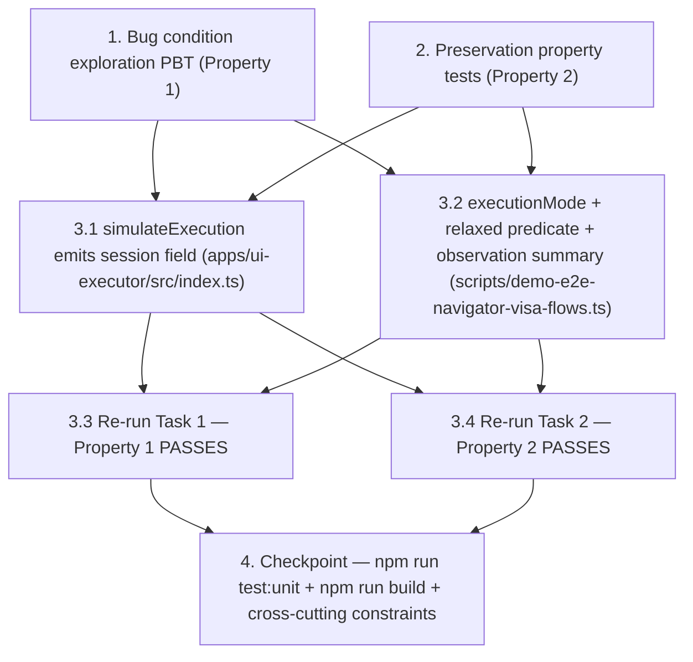

# Implementation Plan

## Overview

This plan fixes the deterministic timeout of the
`ui.navigator.visa_vertical_flows` scenario on the GitHub Actions
`windows-2025` runner image, where the polling helper
`waitForBrowserJobState` in `scripts/demo-e2e-navigator-visa-flows.ts`
combines a `status` check with a `predicate` that the simulation code path
inside `apps/ui-executor/src/index.ts` (`simulateExecution()`) cannot
satisfy. The fix has two cooperating layers:

1. **`apps/ui-executor/src/index.ts`** — `simulateExecution()` emits a
   well-formed `session` field that mirrors the real-Playwright shape and
   self-identifies as simulated.
2. **`scripts/demo-e2e-navigator-visa-flows.ts`** — adds an
   `executionMode` discriminator (`"real_playwright"` vs `"simulated"`),
   gates the strict persistent-session predicate on
   `executionMode === "real_playwright"`, keeps a softer simulation-mode
   predicate for the CI fallback path, and surfaces the predicate
   observation in `waitForBrowserJobState`'s timeout error message.

The plan follows the bugfix exploratory testing methodology:

- **Task 1** writes the bug condition exploration PBT BEFORE the fix; it
  MUST FAIL on unfixed code (failure proves the bug exists).
- **Task 2** writes preservation property tests BEFORE the fix; they MUST
  PASS on unfixed code (confirming baseline behavior to preserve).
- **Task 3** implements the two-layer fix and re-runs Tasks 1 and 2.
- **Task 4** is the final checkpoint over the full unit suite, build, and
  cross-cutting constraints.

## Cross-cutting Rules

These rules apply to every task in this plan. Violating any rule blocks the
task from being marked complete.

- Touch ONLY `apps/ui-executor/src/index.ts`,
  `scripts/demo-e2e-navigator-visa-flows.ts`, and the unit test files
  identified by Tasks 1 and 2 (the existing
  `tests/unit/demo-e2e-navigator-visa-flows.test.ts`).
- DO NOT add `fast-check` as a dev dependency. All property-based tests in
  this plan use a hand-rolled generator (consistent with the prior bugfix
  slice in this repo).
- DO NOT modify `scripts/release-evidence-report.ps1`.
- DO NOT modify `scripts/demo-e2e.ps1` (the visa flows scenario is
  TS-driven, not PowerShell-driven).
- DO NOT modify `.github/workflows/release-strict-final.yml` or
  `.github/workflows/pr-quality.yml`.
- DO NOT skip the visa flows scenario on Windows or any other host.
- DO NOT remove or rename any field on the navigator-visa-flows artifact;
  only ADD `executionMode`.
- DO NOT weaken any existing real-Playwright assertion.
- The exploration PBT in Task 1 lives in
  `tests/unit/demo-e2e-navigator-visa-flows.test.ts` (chosen over a new
  `tests/unit/ui-executor-simulate-session-shape.test.ts` to minimize file
  fan-out — the failure semantics are about the visa flows predicate /
  poll flow, not about ui-executor internals; the existing file already
  owns this scenario's unit coverage).
- All PBT tests run pure in-process: no real network calls, no real
  ui-executor server, no real Playwright browser.

## Tasks

- [x] 1. Write bug condition exploration property test
  - **Property 1: Bug Condition** - Strict Predicate Times Out On Simulation-Shaped Session
  - **CRITICAL**: This test MUST FAIL on unfixed code. Failure confirms the
    bug exists. **DO NOT attempt to fix the test or the production code
    when it fails in this task.**
  - **NOTE**: This test encodes the expected behavior; it will validate the
    fix when it passes after Task 3.1 + 3.2 land.
  - **GOAL**: Surface counterexamples that demonstrate the bug exists by
    showing the strict predicate cannot be satisfied for any
    simulation-shaped `(jobStatus, sessionShape)` pair, while the new
    execution-mode-aware predicate accepts every same pair when the run is
    marked `executionMode === "simulated"`.
  - **Scoped PBT Approach**: For deterministic reproducibility, the
    property is scoped to the concrete failing case the design captures —
    `(jobStatus = "paused", sessionShape = {persistenceEnabled: false,
    status: "pending", mode: "resumable"})` — and is exercised over a
    hand-rolled generator that produces 8 variations of the
    simulation-shape session (missing `session` field, `status =
    "ephemeral"`, `mode = "ephemeral"`, etc., with `jobStatus` held at
    `"paused"`).
  - **File location**: Add the new `test()` block to
    `tests/unit/demo-e2e-navigator-visa-flows.test.ts` (chosen over a new
    `tests/unit/ui-executor-simulate-session-shape.test.ts` to minimize
    file fan-out, per Cross-cutting Rules; the failure semantics live in
    the visa flows predicate / poll flow).
  - **Test harness**:
    - Hand-roll a synthetic `FakeBrowserJobsApi` that serves
      `/browser-jobs/<jobId>` responses driven by the generator. Pure
      in-process, no real network, no real ui-executor server, no real
      Playwright.
    - Drive a small in-test poll harness that mirrors
      `waitForBrowserJobState`'s loop semantics with a short timeout
      (e.g. 750 ms) so the test completes quickly.
    - Inline the **OLD strict predicate** logic (`session?.mode ===
      "resumable" && session?.persistenceEnabled === true &&
      (session?.status === "ready" || session?.status === "active")`) AND
      the **NEW execution-mode-aware predicate** logic side by side, the
      same way the prior bugfix slice's exploration PBT inlined OLD vs
      NEW assertion strategies.
  - **Assertions**:
    - For every generated sample, the OLD strict predicate returns false
      forever and the poll harness throws with `Last status: paused` —
      this is the captured counterexample (per design Bug Condition,
      isBugCondition pseudocode).
    - For every same sample, the NEW execution-mode-aware predicate
      accepts when the run is marked `executionMode === "simulated"`.
  - **Run on UNFIXED code**.
  - **EXPECTED OUTCOME**: Test FAILS on unfixed code (this is correct — it
    proves the bug exists). Document the captured counterexamples as part
    of the test output (e.g. `calculated counterexample: jobStatus=paused,
    sessionShape={persistenceEnabled:false, status:pending} — strict
    predicate timed out, new predicate accepted`).
  - **Cleanup**: No real network calls, no real ui-executor server. Pure
    in-process. The new `test()` block must not leak globals or pollute
    other tests in the file.
  - Mark task complete when the test is written, run on unfixed code, and
    the failure / captured counterexamples are documented in the task
    record.
  - _Requirements: 1.1, 1.2, 2.2, 2.3, 3.4, 3.6_

- [x] 2. Write preservation property tests (BEFORE implementing fix)
  - **Property 2: Preservation** - Real-Playwright Predicate And Schema Are Unchanged
  - **IMPORTANT**: Follow observation-first methodology. Run UNFIXED code
    against non-bug-condition inputs first, observe the actual outputs,
    then write property-based tests that assert those observed outputs
    across the input domain.
  - **File location**: Add the new `test()` block(s) to
    `tests/unit/demo-e2e-navigator-visa-flows.test.ts` (same file as Task
    1, per Cross-cutting Rules).
  - **Activation gate**: The property block MUST be gated on
    `typeof inferExecutionMode === "function"` (the helper that Task 3.2
    will introduce in `scripts/demo-e2e-navigator-visa-flows.ts`). On
    UNFIXED code the helper does not exist yet, so the gate
    short-circuits and the block is a no-op (test reports as passing /
    skipped). After Task 3.2 lands, the gate flips and the assertions
    activate. This pattern mirrors the prior bugfix slice's preservation
    PBT activation gate.
  - **Cases** (each is a property over a hand-rolled generator; no
    `fast-check` dep):
    - **2.a Real-Playwright Ready**: Real-Playwright session shape with
      `persistenceEnabled = true, status = "ready"`, `mode = "resumable"`
      → execution-mode-aware predicate accepts (preserved behavior, same
      as today's strict predicate).
    - **2.b Real-Playwright Active**: Real-Playwright session shape with
      `persistenceEnabled = true, status = "active"`, `mode = "resumable"`
      → execution-mode-aware predicate accepts.
    - **2.c Real-Playwright No Persistence**: Real-Playwright session
      shape with `persistenceEnabled = false` → execution-mode-aware
      predicate STILL REJECTS (no weakening of the production proof; the
      strict predicate still applies on the real-Playwright path).
    - **2.d Status Mismatch**: `jobStatus = "running"` (anything other
      than the target set), even with a valid session shape → predicate
      stays false on BOTH the OLD strict path AND the NEW
      execution-mode-aware path (still polling, no early acceptance).
  - **Observation**: Before writing the property assertions, run the
    UNFIXED code's strict predicate against each case and record the
    observed boolean outcomes in the test (e.g. `// observed: case 2.a
    returns true on unfixed code`, `// observed: case 2.c returns false
    on unfixed code`). The property-based test then asserts those
    observed outcomes hold for the entire generated input domain.
  - **Run on UNFIXED code**.
  - **EXPECTED OUTCOME**:
    - On UNFIXED code: the activation gate short-circuits (helper does
      not exist yet) so the block reports as no-op / passing.
    - After Task 3.2 lands: the gate flips, the assertions activate, and
      all four cases pass on FIXED code.
  - Mark task complete when the property tests are written, the
    activation gate is in place, the unfixed-code observation comments
    are recorded, and the block reports passing on unfixed code.
  - _Requirements: 2.1, 3.1, 3.2, 3.3, 3.5_

- [x] 3. Two-layer fix for visa flows scenario simulation-fallback timeout

  - [x] 3.1 Modify `apps/ui-executor/src/index.ts` `simulateExecution()` to emit a populated `session` field
    - Extract the `persistenceRequested` / `persistenceEnabled` /
      `persistAfterRun` locals above the
      `forceSimulation` / `simulateIfUnavailable` branch so both the
      real-Playwright call site and the `simulateExecution()` call site
      can read them — OR pass them through as parameters to
      `simulateExecution()` — whichever produces the smaller diff in this
      file (pick the option that does not change the function signatures
      of any other exported helper).
    - Make `simulateExecution()` return an `ExecuteResponse` with a
      populated `session` field whose shape mirrors the real-Playwright
      path:
      - `mode: persistenceRequested ? "resumable" : "ephemeral"`
      - `key: persistenceEnabled ? requestedSessionKey : null`
      - `persistenceRequested`
      - `persistenceEnabled`
      - `status` derived from `persistenceEnabled` / `persistAfterRun` /
        `finalStatus` per the design (not real Playwright lifecycle
        markers but a deterministic mirror of them)
      - `reuseCount: 0`
      - `lastPageUrl: null`
      - `notes` MUST include the explicit simulation marker
        `"Simulated browser session: no real persistent session was held."`
    - Verify with `npm run build` that strict TS still compiles
      (`apps/ui-executor` builds clean).
    - _Bug_Condition: isBugCondition({jobStatus: "paused", sessionMode: "resumable", sessionPersistenceEnabled: false, sessionStatus: "pending", targetStatuses: ["paused"], predicateRequiresSession: true}) — the missing `session` field on simulateExecution's response is half of the bug condition_
    - _Expected_Behavior: simulateExecution() returns a session field whose `persistenceEnabled` reflects requested persistence + config flag, whose `status` matches the simulated lifecycle, and whose `notes` carry the simulation marker; the browser-job session record reaches a deterministic terminal state in simulation_
    - _Preservation: real-Playwright execution path (lines 1373-1389 area) is untouched; existing `apps/ui-executor` tests in `tests/unit/ui-executor-browser-jobs.test.ts` continue to pass; the ExecuteResponse contract on the real-Playwright path is unchanged_
    - _Requirements: 1.1, 2.2, 3.4_

  - [x] 3.2 Modify `scripts/demo-e2e-navigator-visa-flows.ts` to add execution-mode-aware predicate and improved error context
    - Add an `inferExecutionMode(adapterNotes: string[]): "real_playwright" | "simulated"` helper. Detection rule (exact regex):
      `adapterNotes.some(note => /Forced simulation|Playwright unavailable in ui-executor|Simulated browser session/i.test(note)) ? "simulated" : "real_playwright"`.
    - Add `executionMode: "real_playwright" | "simulated"` to the
      `VisaFlowResult` shape AND to the persisted artifact shape that
      gets written to `artifacts/demo-e2e/navigator-visa-flows.json`.
      The field is purely additive; no existing field is removed,
      renamed, or made optional.
    - Split the paused-state poll's predicate into two paths gated on
      `executionMode`:
      - Real-Playwright path: KEEP the existing strict predicate
        (`session?.mode === "resumable" && session?.persistenceEnabled
        === true && (session?.status === "ready" || session?.status ===
        "active")`).
      - Simulated path: relaxed predicate
        (`session?.mode === "resumable" && session?.persistenceRequested
        === true`). Does NOT require `persistenceEnabled === true`
        (simulation lane does not exercise a real persistent session).
    - Adjust the corresponding post-condition asserts (around current
      line 567) to be execution-mode-aware: real-Playwright runs continue
      to assert the strict persistent-session proof; simulated runs
      assert the simulation-mode markers and the artifact's
      `executionMode === "simulated"`.
    - Extend `waitForBrowserJobState` with an optional
      `describeLastObservation?: (response) => string` parameter. The
      visa flows scenario passes a function that emits a single-line
      summary, e.g.
      `"predicate observed mode=resumable, persistenceEnabled=false, status=pending; required persistenceEnabled=true, status∈{ready, active}"`.
      On timeout, the helper's error message includes this summary
      alongside `Last status: <status>`.
    - Verify with `npm run build` that strict TS still compiles.
    - _Bug_Condition: isBugCondition({jobStatus: "paused", sessionMode: "resumable", sessionPersistenceEnabled: false, sessionStatus: "pending", targetStatuses: ["paused"], predicateRequiresSession: true}) — the strict predicate is unsatisfiable on simulation-shaped responses, the other half of the bug condition_
    - _Expected_Behavior: For runs where executionMode === "simulated", the relaxed predicate accepts on first poll once the job reaches "paused"; for runs where executionMode === "real_playwright", the strict predicate continues to apply unchanged; the artifact carries a truthful executionMode discriminator; on genuine timeouts the error message surfaces the predicate observation summary_
    - _Preservation: real-Playwright assertion set is unchanged (strict predicate still gates real-Playwright runs); the navigator-visa-flows artifact schema is additive only (no field removed or renamed); release-evidence-report's existing artifact assertions continue to pass; tests/unit/demo-e2e-navigator-visa-flows.test.ts existing assertions are untouched_
    - _Requirements: 1.1, 1.2, 2.1, 2.2, 2.3, 3.1, 3.2, 3.3, 3.4, 3.5, 3.6_

  - [x] 3.3 Verify bug condition exploration test now passes
    - **Property 1: Expected Behavior** - Strict Predicate Times Out On Simulation-Shaped Session
    - **IMPORTANT**: Re-run the SAME test from Task 1. **Do NOT write a
      new test.** The test from Task 1 encodes the expected behavior;
      when it passes, it confirms the expected behavior is satisfied.
    - Re-run the bug condition exploration PBT from Task 1 on FIXED code
      (post Task 3.1 + 3.2).
    - **EXPECTED OUTCOME**: Test PASSES on Linux AND on Windows. The
      simulation-mode samples accept under the new
      execution-mode-aware predicate, the real-Playwright-mode samples
      preserve their accept / reject outcomes from the OLD strict
      predicate, and error messages on genuine timeouts include the
      predicate observation summary.
    - _Requirements: Expected Behavior Properties — 2.1, 2.2, 2.3, 3.4, 3.6_

  - [x] 3.4 Verify preservation tests still pass
    - **Property 2: Preservation** - Real-Playwright Predicate And Schema Are Unchanged
    - **IMPORTANT**: Re-run the SAME tests from Task 2. **Do NOT write
      new tests.**
    - Re-run the preservation property block from Task 2 on FIXED code.
      The activation gate (`typeof inferExecutionMode === "function"`)
      now flips on because Task 3.2 introduced the helper, so the
      assertions activate.
    - **EXPECTED OUTCOME**: All four cases (2.a Real-Playwright Ready,
      2.b Real-Playwright Active, 2.c Real-Playwright No Persistence,
      2.d Status Mismatch) pass on FIXED code. No regressions.
    - _Requirements: 2.1, 3.1, 3.2, 3.3, 3.5_

- [x] 4. Checkpoint - Ensure all tests pass and cross-cutting constraints hold
  - Run `npm run test:unit` locally on Windows. Confirm the full unit
    suite passes, modulo the pre-existing 28-fail
    `release-readiness.test.ts` / `public-badge-check.test.ts` cluster on
    Windows ru-RU PowerShell mojibake (known infra debt, out of scope for
    this spec — record the count and note it is unchanged).
  - Run `npm run build`. Confirm `apps/ui-executor` and
    `scripts/demo-e2e-navigator-visa-flows.ts` still compile under strict
    TS (exit 0).
  - Confirm `tests/unit/ui-executor-browser-jobs.test.ts` still passes
    with all existing assertions intact.
  - Confirm `tests/unit/demo-e2e-navigator-visa-flows.test.ts` still
    passes with all existing assertions intact (the new Task 1 +
    Task 2 blocks are additive).
  - Confirm `tests/unit/release-evidence-report.test.ts` still passes
    7/7 (artifact schema is backwards-compatible because `executionMode`
    is purely additive).
  - Re-confirm cross-cutting constraints (per the Cross-cutting Rules
    section above): no edit to `scripts/release-evidence-report.ps1`, no
    edit to `.github/workflows/release-strict-final.yml` /
    `.github/workflows/pr-quality.yml`, no edit to
    `scripts/demo-e2e.ps1`, no `fast-check` dependency added, the visa
    flows scenario is NOT skipped on any host.
  - Confirm the navigator-visa-flows artifact carries
    `executionMode === "simulated"` on the windows-2025 PR-quality lane
    and `executionMode === "real_playwright"` on the
    release-strict-final lane (the latter verified via local probe or
    follow-up release-strict run, per design Testing Strategy →
    Integration Tests).
  - Ensure all tests pass. Ask the user if questions arise.
  - _Requirements: 1.1, 1.2, 2.1, 2.2, 2.3, 3.1, 3.2, 3.3, 3.4, 3.5, 3.6_

## Task Dependency Graph

```json
{
  "waves": [
    {
      "wave": 1,
      "tasks": ["1", "2"],
      "rationale": "Both exploration (Task 1) and preservation (Task 2) PBTs are written and run BEFORE the fix. They are independent of each other (different files of test focus, different assertion sets) and can be authored in parallel. Both must complete before any implementation begins."
    },
    {
      "wave": 2,
      "tasks": ["3.1", "3.2"],
      "rationale": "The two-layer fix has two production-code edits in two different files. 3.1 (apps/ui-executor/src/index.ts) and 3.2 (scripts/demo-e2e-navigator-visa-flows.ts) cooperate but do not import each other; they can be authored in parallel. Each one alone is insufficient (3.1 alone leaves the strict predicate unsatisfied because executionMode is still missing; 3.2 alone leaves the simulation-mode session shape malformed)."
    },
    {
      "wave": 3,
      "tasks": ["3.3", "3.4"],
      "rationale": "Verification re-runs of the SAME tests from Tasks 1 and 2 against the now-fixed code. They depend on Wave 2 (both 3.1 and 3.2) being complete. They are independent of each other and can run in parallel."
    },
    {
      "wave": 4,
      "tasks": ["4"],
      "rationale": "Final checkpoint over the full unit suite, build, and cross-cutting constraints. Depends on Wave 3 verification being green."
    }
  ]
}
```



## Notes

- **Why two-layer fix.** A single-defect fix (e.g. only patching
  `simulateExecution()` to emit fake-but-passing session markers) would
  let the artifact lie about whether a real persistent session was
  exercised, and a single-defect fix to only the scenario predicate (e.g.
  dropping the persistent-session assertion) would weaken the production
  proof. The two-layer fix keeps production proof intact and makes the
  simulation honest. See design.md → Hypothesized Root Cause.
- **Why `tests/unit/demo-e2e-navigator-visa-flows.test.ts` over a new
  `tests/unit/ui-executor-simulate-session-shape.test.ts`.** The
  exploration PBT's failure semantics are about the visa flows
  predicate / poll flow, not about ui-executor's `simulateExecution()`
  internals. The existing file already owns this scenario's unit
  coverage. Adding the new `test()` block there minimizes file fan-out
  and keeps the scenario-level assertions colocated.
- **Why the activation gate on the preservation block.** Task 2 must run
  on UNFIXED code to capture observation comments and report passing /
  no-op, but it asserts behavior that only exists after Task 3.2
  introduces `inferExecutionMode`. The
  `typeof inferExecutionMode === "function"` gate short-circuits on
  unfixed code and activates after Task 3.2 lands. This pattern mirrors
  the prior bugfix slice in this repo.
- **Why scoped PBT for the exploration test.** The bug is deterministic
  given a `(jobStatus = "paused", sessionShape = simulation-default)`
  pair. Scoping the property to that concrete failing case (varying only
  the session-shape variations) ensures reproducibility on Windows and
  Linux without flakiness, while still demonstrating the OLD vs NEW
  predicate contrast across a small generated domain.
- **Why no `fast-check` dependency.** The prior bugfix slice in this repo
  established a hand-rolled generator pattern. Adding `fast-check` for a
  small in-process PBT would be drive-by tooling churn that the
  Cross-cutting Rules explicitly forbid.
- **Pre-existing 28-fail Windows mojibake cluster.** The
  `release-readiness.test.ts` / `public-badge-check.test.ts` Windows
  ru-RU PowerShell mojibake failures are tracked separately as known
  infra debt. Task 4 records the count to confirm this fix does not
  perturb that cluster.
- **Out of scope.** No changes to `scripts/release-evidence-report.ps1`,
  release KPI gates, `release-strict-final.yml`, `pr-quality.yml`,
  `scripts/demo-e2e.ps1`, or any artifact field other than the additive
  `executionMode`. The visa flows scenario is NOT skipped on any host.
