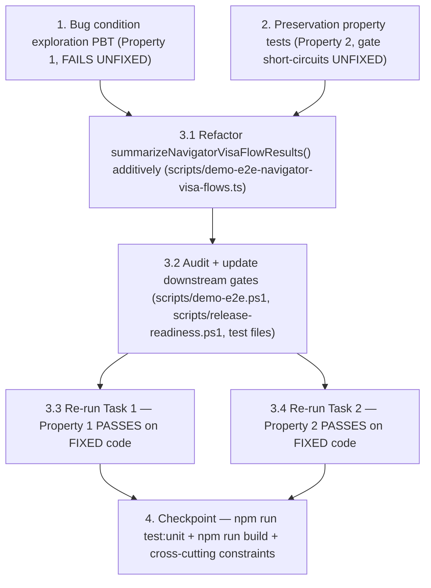

# Implementation Plan: demo-e2e-visa-flows-execution-mode-aware-summary

## Overview

Bugfix slice that fixes the validation summary layer of the
`ui.navigator.visa_vertical_flows` demo-e2e scenario after the previous
slice (`demo-e2e-browser-job-paused-race-condition`) made the polling
predicate execution-mode-aware. On CI run `26368008011` at commit
`3aa4d877` the scenario no longer times out — it fails fast with
`Navigator visa proof must validate all configured flows.` because
`summarizeNavigatorVisaFlowResults()` in
`scripts/demo-e2e-navigator-visa-flows.ts` still applies the strict
real-Playwright contract (persistent session + replay bundle + verified +
stale/healed recovery + resumed checkpoint counts) to results that
honestly self-report `executionMode === "simulated"` and therefore cannot
satisfy any of those counts.

The fix is two-layer because patching either layer alone produces a
dishonest artifact:

1. **Summary contract layer** (`scripts/demo-e2e-navigator-visa-flows.ts`):
   refactor `summarizeNavigatorVisaFlowResults()` additively per
   `design.md` Proposed Contract. Add `validationMode`,
   `realPlaywrightValidated`, `simulatedValidated`,
   `strictPersistentSessionValidated`, and `executionModeCounts`. The
   existing `validated` field is RETAINED — its meaning is documented to
   mirror the declared validation mode (`real_playwright` keeps today's
   strict criteria identically; `simulated` validates the simulation
   contract; `mixed` / `unknown` returns `false`). Export a new
   `inferNavigatorVisaFlowValidationMode(results)` named helper so
   downstream gates and tests can branch on declared mode without
   re-implementing the rule.
2. **Downstream gate layer** (`scripts/demo-e2e.ps1`,
   `scripts/release-readiness.ps1`, and their corresponding test files):
   Task 1's audit names every consumer of `validated`. PR Quality may
   accept simulation proof only when an explicit env opt-in is set;
   release-strict gates switch to reading
   `strictPersistentSessionValidated` so they always require real
   persistent-session evidence regardless of declared mode.

Tasks follow the bugfix workflow ordering: exploration PBT first
(Property 1 — proves the bug condition exists by showing the OLD strict
`validated` is `false` for honest simulation results that the NEW
mode-aware criteria would accept), preservation PBT next (Property 2 —
records non-bug-condition behavior to preserve: real-Playwright accept,
real-Playwright partial reject, mixed reject, unknown reject, strict
persistent-session split), then the fix in two production sub-tasks
(summary refactor, downstream gate audit + update) plus two re-run
sub-tasks, then a final validation checkpoint
(`npm run test:unit`, `npm run build`).

## Cross-cutting Rules

These constraints apply to every task and MUST NOT be violated. Violating
any rule blocks the task from being marked complete.

- Touch ONLY `scripts/demo-e2e-navigator-visa-flows.ts`,
  `tests/unit/demo-e2e-navigator-visa-flows.test.ts`, AND any downstream
  gate / consumer files identified by Task 1's audit (commonly
  `scripts/demo-e2e.ps1`, `scripts/release-readiness.ps1`, and the
  corresponding test files for those PowerShell scripts:
  `tests/unit/release-readiness.test.ts`,
  `tests/unit/release-evidence-report.test.ts`,
  `tests/unit/runbook-release-alignment.test.ts`).
- Do NOT add `fast-check` as a dev dependency. All property-based tests
  in this plan use a hand-rolled generator (consistent with the prior
  bugfix slices on this branch).
- Do NOT modify
  `apps/demo-frontend/app-shell/src/components/workspace/LiveDesk.tsx`
  (local-services dispatcher UI is out of scope per `bugfix.md` R6).
- Do NOT modify `apps/ui-executor/src/index.ts` (that was the previous
  slice — `simulateExecution()` already emits the populated `session`
  field this slice depends on).
- Do NOT modify `scripts/release-evidence-report.ps1` (the
  release-evidence emitter consumes the artifact downstream; its
  behavior must continue to work because the schema change is purely
  additive).
- Do NOT modify `.github/workflows/*.yml`. PR Quality opt-in env wiring
  is a follow-up commit, not part of this slice.
- Do NOT skip `ui.navigator.visa_vertical_flows` on release-strict
  workflows. Release-strict still runs the scenario; the fix is to make
  the strict gate read `strictPersistentSessionValidated` instead of
  `validated`.
- Do NOT fake real persistent-session or replay-bundle proof in
  simulation mode. Simulation criteria must NOT increment
  `persistentSessionCount` or `replayBundleCount`; they are honest about
  the absence of real persistent session and replay bundle.
- Do NOT remove or rename existing fields from `VisaFlowSummary`; only
  ADD `validationMode`, `realPlaywrightValidated`, `simulatedValidated`,
  `strictPersistentSessionValidated`, `executionModeCounts`. The existing
  `validated` field MUST be retained but its meaning is documented to
  mirror the declared validation mode (PR Quality may now read
  `validated && validationMode === "simulated"` honestly; release-strict
  reads `strictPersistentSessionValidated`).
- Do NOT weaken any real-Playwright assertion. The real-Playwright
  branch of the new `validated` rule MUST produce identical
  accept/reject outcomes to today's strict criteria for every
  real-Playwright input.
- All PBT tests run pure in-process: no real network calls, no real
  ui-executor server, no real Playwright browser.

## Tasks

- [x] 1. Write bug condition exploration property test
  - **Property 1: Bug Condition** - Simulation Lane Summary Cannot Validate Under Current Strict Criteria
  - **CRITICAL**: This test MUST FAIL on unfixed code. Failure confirms
    the bug exists. **DO NOT attempt to fix the test or the production
    code when it fails in this task.**
  - **NOTE**: This test encodes the expected behavior; it will validate
    the fix when it passes after Task 3.1 lands.
  - **GOAL**: Surface counterexamples that demonstrate
    `summarizeNavigatorVisaFlowResults().validated` returns `false` for
    every honestly-shaped simulation lane input, while the inlined
    NEW execution-mode-aware criteria return `true` for the same inputs.
  - **Pre-step (audit + consumer map)**: Before writing the PBT, audit
    every downstream consumer of the navigator-visa-flows artifact and
    record the consumer list in the task notes / PR description per
    `bugfix.md` R5 and `design.md` Downstream Gate Update. Concretely
    record:
    - `scripts/demo-e2e.ps1` line ~3241
      (`Navigator visa proof must validate all configured flows.`) — reads
      `validated`.
    - `scripts/release-readiness.ps1` — KPI fields
      (`navigatorVisaFlowsValidated`, `navigatorVisaFlowsPersistentSessionCount`,
      etc.) but NOT the artifact `validated` directly today; confirm
      whether the KPI block needs to switch to
      `strictPersistentSessionValidated`.
    - Test files that assert the artifact / KPI shape:
      `tests/unit/demo-e2e-navigator-visa-flows.test.ts`,
      `tests/unit/release-readiness.test.ts`,
      `tests/unit/release-evidence-report.test.ts`,
      `tests/unit/runbook-release-alignment.test.ts`.
    - Workflows that are simulation lanes vs real-Playwright lanes:
      PR Quality (windows-2025 simulation lane), release-strict-final
      (real-Playwright lane).
  - **Scoped PBT Approach**: Because `fast-check` is not a dev
    dependency, hand-roll a small generator that produces N=8
    simulation-shape `VisaFlowResult` arrays (size 3..6) where every
    result has `executionMode === "simulated"`, `success === true`,
    `finalStatus === "completed"`, `pausedStatus === "paused"`,
    `persistentSessionReady === false`,
    `persistentSessionReleased === false`,
    `replayBundlePresent === false`,
    `verificationState === null`, all recovery / resumed-checkpoint
    counters at zero (because the simulation lane never holds a real
    persistent session, never produces a real replay bundle, and never
    exercises real ref-healing or checkpoint resume). Vary
    `actionPlanSteps`, `blockedPlanSteps`, `traceCount`, scenario `name`,
    `url`, `jobId` across the 8 samples for input-domain coverage.
  - **File location**: Add the new `test()` block to
    `tests/unit/demo-e2e-navigator-visa-flows.test.ts` (the file already
    owns this scenario's unit coverage).
  - **Test harness**:
    - Inline the **OLD strict criteria** logic (today's
      `summarizeNavigatorVisaFlowResults().validated` rule:
      `succeededFlows === totalFlows
       && persistentSessionCount === totalFlows
       && replayBundleCount === totalFlows
       && verifiedCount === totalFlows
       && staleRecoveryObservedCount === totalFlows
       && healedRecoveryObservedCount === totalFlows
       && resumedCheckpointCount === totalFlows`).
    - Inline the **NEW execution-mode-aware simulation criteria** logic
      (per `design.md` Simulation Criteria:
      `totalFlows >= 3
       && succeededFlows === totalFlows
       && every result.executionMode === "simulated"
       && every result.finalStatus === "completed"
       && every result.pausedStatus === "paused"`).
  - **Assertions**:
    - For every generated sample, calling the existing imported
      `summarizeNavigatorVisaFlowResults(results).validated` returns
      `false` (captured counterexample evidence — proves the bug exists
      per `bugfix.md` R1 and `design.md` Hypothesized Root Cause).
    - For every same sample, the inlined NEW simulation criteria return
      `true` (proves the new contract would accept the same honest
      inputs).
  - **Run on UNFIXED code with the OLD branch active**.
  - **EXPECTED OUTCOME**: Test FAILS on unfixed code (this is correct —
    failure / counterexample capture is the SUCCESS signal per the
    bugfix-workflow exploration test contract). Document the captured
    counterexamples as part of the test output, e.g.
    `counterexample: simulation lane sample with totalFlows=3, all
    succeeded, all paused→completed → OLD validated=false; NEW
    validated=true`.
  - **Cleanup**: Pure in-process; no real network, no real ui-executor
    server, no real Playwright. The new `test()` block must not leak
    globals or pollute other tests in the file.
  - Mark task complete when the audit/consumer map is recorded, the
    test is written, run on unfixed code, and the failure /
    counterexamples are documented.
  - _Bug_Condition: isBugCondition({results}) where every
    result.executionMode === "simulated" AND every result.success === true
    AND every result.finalStatus === "completed" AND every result.pausedStatus === "paused"
    AND every result.persistentSessionReady === false
    AND every result.replayBundlePresent === false_
  - _Expected_Behavior: For inputs satisfying the bug condition,
    summarizeNavigatorVisaFlowResults(results).validated should return
    true under the NEW execution-mode-aware simulation criteria
    (validationMode === "simulated", simulatedValidated === true)_
  - _Preservation: Real-Playwright criteria unchanged for inputs where
    every executionMode === "real_playwright"_
  - _Requirements: R1, R2, R4_

- [x] 2. Write preservation property tests (BEFORE implementing fix)
  - **Property 2: Preservation** - Real-Playwright Validates, Mixed/Unknown Reject, Strict Persistent-Session Split
  - **IMPORTANT**: Follow observation-first methodology. Run UNFIXED code
    against non-bug-condition inputs first, observe the actual outputs,
    then write property-based tests that assert those observed outputs
    across the input domain.
  - **File location**: Add the new `test()` block(s) to
    `tests/unit/demo-e2e-navigator-visa-flows.test.ts` (same file as
    Task 1, per Cross-cutting Rules).
  - **Activation gate**: The property block MUST be gated on
    `typeof inferNavigatorVisaFlowValidationMode === "function"` (the
    helper that Task 3.1 will introduce in
    `scripts/demo-e2e-navigator-visa-flows.ts`). On UNFIXED code the
    helper does not exist yet, so the gate short-circuits and the block
    is a no-op (test reports as passing / skipped). After Task 3.1 lands,
    the gate flips and the assertions activate. This pattern mirrors the
    prior bugfix slice's preservation PBT activation gate.
  - **Cases** (each is a property over a hand-rolled generator with N=8
    samples; no `fast-check` dep):
    - **2.a Real-Playwright Successful**: Generate `VisaFlowResult[]`
      where every result has `executionMode === "real_playwright"`,
      `success === true`, `finalStatus === "completed"`,
      `pausedStatus === "paused"`,
      `persistentSessionReady === true`,
      `persistentSessionReleased === true`,
      `replayBundlePresent === true`,
      `verificationState === "verified"`,
      `staleRefCount >= 1`, `healedRefCount >= 1`,
      `resumedCheckpointCount >= 1`, `checkpointReadyCleared === true`.
      Assert `summary.validated === true`,
      `summary.validationMode === "real_playwright"`,
      `summary.realPlaywrightValidated === true`,
      `summary.simulatedValidated === false`,
      `summary.strictPersistentSessionValidated === true`. Preserves
      today's strict acceptance.
    - **2.b Real-Playwright One Flow Missing Persistent Session**:
      Generate samples identical to 2.a but with exactly one result
      flipping `persistentSessionReady === false` (chosen index varies
      across samples). Assert `summary.validated === false`,
      `summary.validationMode === "real_playwright"`,
      `summary.realPlaywrightValidated === false`,
      `summary.strictPersistentSessionValidated === false`. Preserves
      today's strict rejection of partial real-Playwright proof.
    - **2.c Mixed (some real_playwright + some simulated)**: Generate
      samples where at least one result has
      `executionMode === "real_playwright"` and at least one has
      `executionMode === "simulated"`. Assert
      `summary.validationMode === "mixed"`,
      `summary.validated === false` (regardless of any per-result
      success), `summary.realPlaywrightValidated === false`,
      `summary.simulatedValidated === false`. Preserves the rule that
      mixed mode is not a validated proof until a deliberate mixed-mode
      contract is designed (per `design.md` Mixed Mode).
    - **2.d Unknown (executionMode missing or invalid)**: Generate
      samples where at least one result has `executionMode` set to a
      value outside the expected union (`undefined`, `null`, `"local"`,
      empty string). Assert `summary.validationMode === "unknown"`,
      `summary.validated === false`. Preserves the conservative default.
    - **2.d2 Real-Playwright Strict Persistent Session Validated**:
      Generate two sample sets:
      - Sample set A: every result has
        `persistentSessionReady === true && persistentSessionReleased === true`
        → assert `summary.strictPersistentSessionValidated === true`.
      - Sample set B: at least one result has
        `persistentSessionReady === false || persistentSessionReleased === false`
        (independent of every other field) → assert
        `summary.strictPersistentSessionValidated === false`.
      This proves the new field correctly distinguishes real-Playwright
      proof from simulation regardless of `validationMode`, so
      release-strict gates can depend on the new field instead of
      `validated`.
  - **Observation phase** (record before assertions): Run the UNFIXED
    `summarizeNavigatorVisaFlowResults()` against each case, record the
    observed boolean outcomes for `validated` (`2.a → true`,
    `2.b → false`, `2.c → false`, `2.d → false`, `2.d2.A → true`,
    `2.d2.B → false`) as `// observed: ...` comments in the test, and
    confirm the cases match the documented baseline before writing
    forward-looking assertions on the new fields.
  - **Run on UNFIXED code**.
  - **EXPECTED OUTCOME**:
    - On UNFIXED code: the activation gate short-circuits (helper does
      not exist yet) so the block reports as no-op / passing.
    - After Task 3.1 lands: the gate flips, the assertions activate, and
      all five cases pass on FIXED code.
  - Mark task complete when the property tests are written, the
    activation gate is in place, the unfixed-code observation comments
    are recorded, and the block reports passing on unfixed code.
  - _Bug_Condition: ¬isBugCondition(results) — non-buggy inputs where
    NOT every result.executionMode === "simulated"_
  - _Expected_Behavior: Real-Playwright proof continues to validate
    (2.a), partial real-Playwright continues to reject (2.b), mixed and
    unknown reject (2.c, 2.d), strict persistent-session field
    distinguishes real proof from simulation independently (2.d2)_
  - _Preservation: Today's strict acceptance/rejection outcomes for
    real-Playwright inputs MUST be identical under the new contract; the
    real-Playwright path is not weakened_
  - _Requirements: R2, R3, R5_

- [x] 3. Two-layer fix for execution-mode-aware visa flows summary

  - [x] 3.1 Refactor `summarizeNavigatorVisaFlowResults()` additively in `scripts/demo-e2e-navigator-visa-flows.ts`
    - Add the `NavigatorVisaFlowValidationMode` type per `design.md`
      Proposed Contract:
      ```ts
      export type NavigatorVisaFlowValidationMode =
        | "real_playwright"
        | "simulated"
        | "mixed"
        | "unknown";
      ```
    - Add a new exported helper
      `inferNavigatorVisaFlowValidationMode(results: VisaFlowResult[]): NavigatorVisaFlowValidationMode`.
      Rule:
      - If `results.length === 0` → `"unknown"`.
      - If any `result.executionMode` is not in the union
        (`"real_playwright"` | `"simulated"`) → `"unknown"`.
      - If every `result.executionMode === "real_playwright"` →
        `"real_playwright"`.
      - If every `result.executionMode === "simulated"` →
        `"simulated"`.
      - Otherwise → `"mixed"`.
    - Extend `VisaFlowSummary` ADDITIVELY (no field removed, no field
      renamed, no field made optional) with:
      ```ts
      validationMode: NavigatorVisaFlowValidationMode;
      realPlaywrightValidated: boolean;
      simulatedValidated: boolean;
      strictPersistentSessionValidated: boolean;
      executionModeCounts: {
        real_playwright: number;
        simulated: number;
        unknown: number;
      };
      ```
    - Refactor `summarizeNavigatorVisaFlowResults()` to compute:
      - `validationMode` via the new helper.
      - `executionModeCounts` from the per-result `executionMode` field.
      - `realPlaywrightValidated` per `design.md` Real-Playwright
        Criteria (identical to today's strict rule:
        `totalFlows >= 3 && succeededFlows === totalFlows
         && persistentSessionCount === totalFlows
         && replayBundleCount === totalFlows
         && verifiedCount === totalFlows
         && staleRecoveryObservedCount === totalFlows
         && healedRecoveryObservedCount === totalFlows
         && resumedCheckpointCount === totalFlows`).
      - `simulatedValidated` per `design.md` Simulation Criteria:
        `totalFlows >= 3 && succeededFlows === totalFlows
         && every result.executionMode === "simulated"
         && every result.finalStatus === "completed"
         && every result.pausedStatus === "paused"`.
        Simulation criteria MUST NOT increment
        `persistentSessionCount` or `replayBundleCount` by pretending a
        real browser session existed.
      - `strictPersistentSessionValidated`: `true` iff every result has
        `persistentSessionReady === true && persistentSessionReleased === true`,
        independent of `validationMode`. This is the field
        release-strict gates read.
      - `validated` (RETAINED, semantics documented in a JSDoc comment):
        - `validationMode === "real_playwright"` → mirror
          `realPlaywrightValidated`.
        - `validationMode === "simulated"` → mirror
          `simulatedValidated`.
        - `validationMode === "mixed"` or `"unknown"` → `false`.
    - Existing counters (`persistentSessionCount`,
      `replayBundleCount`, `verifiedCount`,
      `staleRecoveryObservedCount`, `healedRecoveryObservedCount`,
      `resumedCheckpointCount`, `checkpointReadyClearedCount`,
      `scenarioNames`, `results`, `summary`, `successRate`,
      `totalFlows`, `succeededFlows`) are unchanged in name, type, and
      meaning. The artifact JSON gains five new fields; no caller's
      interface is broken.
    - Verify with `npm run build` that strict TS still compiles.
    - _Bug_Condition: isBugCondition({results}) — every executionMode === "simulated"
      AND every success === true AND every persistentSessionReady === false
      AND every replayBundlePresent === false (the strict criteria are unsatisfiable
      on honest simulation results)_
    - _Expected_Behavior: For simulation-mode inputs satisfying the bug
      condition, summary.validated === true via simulatedValidated;
      simulation criteria do not inflate persistentSessionCount or
      replayBundleCount; strictPersistentSessionValidated correctly
      reports false because no real persistent session was held_
    - _Preservation: Real-Playwright accept/reject outcomes are
      identical to today; existing fields untouched; release-evidence
      report consumer remains green because the schema change is purely
      additive_
    - _Requirements: R1, R2, R3, R4_

  - [x] 3.2 Audit + update downstream gates per `bugfix.md` R5 and `design.md` Downstream Gate Update
    - **`scripts/demo-e2e.ps1` line ~3241**
      (`Navigator visa proof must validate all configured flows.`):
      Read `validationMode` from the artifact via `Get-FieldValue` and
      gate acceptance on a new repo-owned env var (default off) — pick
      the smallest-diff option, e.g.
      `DEMO_E2E_VISA_FLOWS_ACCEPT_SIMULATION`. Behavior:
      - Default (env unset or `"false"`): require
        `validationMode === "real_playwright"` AND `validated === true`
        (release-strict-final keeps today's strict semantics).
      - When env is `"true"` (PR Quality lane sets this in a follow-up
        commit, NOT in this slice): accept either
        `(validationMode === "real_playwright" && validated === true)`
        OR `(validationMode === "simulated" && validated === true)`.
      - Reject `validationMode === "mixed"` and `"unknown"` regardless
        of env.
      - The error message MUST surface the observed `validationMode`
        and the env state so failures are diagnosable in CI logs.
      - DO NOT modify any `.github/workflows/*.yml` in this slice; PR
        Quality opt-in env wiring is a follow-up commit per
        Cross-cutting Rules.
    - **`scripts/release-readiness.ps1`**: If the script consumes
      `validated` for the visa flows block in any release-strict KPI
      check, switch that consumer to read
      `strictPersistentSessionValidated` so release-strict gates always
      require real persistent-session evidence regardless of declared
      mode. Today the script reads
      `kpi.navigatorVisaFlowsValidated` (a separately-emitted KPI in
      `scripts/demo-e2e.ps1`'s summary block, lines ~6759-6763); the
      audit in Task 1 confirms the exact shape of that KPI. If the KPI
      is regenerated from the artifact, update the regeneration to emit
      both `navigatorVisaFlowsValidated` (existing, mirrors declared
      mode) AND `navigatorVisaFlowsStrictPersistentSessionValidated`
      (new, release-strict reads this).
    - **Test files** (additive assertions confirming the gate split,
      and updates of any existing assertion that read `validated` to
      instead read the new mode-specific field where appropriate):
      - `tests/unit/demo-e2e-navigator-visa-flows.test.ts`: add summary
        shape assertions for the five new `VisaFlowSummary` fields on a
        real-Playwright happy-path result set and on a
        simulation-happy-path result set; confirm the existing
        `validated` field assertion still passes for the
        real-Playwright case.
      - `tests/unit/release-readiness.test.ts`: add a new KPI override
        + assertion case proving release-strict KPI checks fail when
        `navigatorVisaFlowsStrictPersistentSessionValidated === false`
        even if `navigatorVisaFlowsValidated === true` (i.e. honest
        simulation proof is rejected by release-strict KPI).
      - `tests/unit/release-evidence-report.test.ts`: confirm the
        existing `report.navigatorVisaFlows.validated` and
        `manifest.navigatorVisaFlows.validated` assertions (lines
        ~768-769, ~1086-1087) keep passing because the field is
        retained; add additive assertions for the new fields if the
        release-evidence report surfaces them.
      - `tests/unit/runbook-release-alignment.test.ts`: if the runbook
        documents `kpi.navigatorVisaFlowsValidated=true` (line ~185),
        document the additional release-strict requirement
        `kpi.navigatorVisaFlowsStrictPersistentSessionValidated=true`
        in the same alignment list.
    - DO NOT modify `scripts/release-evidence-report.ps1`; the
      release-evidence report consumes the artifact field-by-field and
      remains green because the schema change is purely additive.
    - DO NOT modify any `.github/workflows/*.yml`.
    - DO NOT skip `ui.navigator.visa_vertical_flows` on
      release-strict-final.
    - Verify with `npm run build` that strict TS still compiles and run
      the targeted unit tests
      (`npm run test:unit -- tests/unit/demo-e2e-navigator-visa-flows.test.ts`,
      `npm run test:unit -- tests/unit/release-readiness.test.ts`,
      `npm run test:unit -- tests/unit/release-evidence-report.test.ts`,
      `npm run test:unit -- tests/unit/runbook-release-alignment.test.ts`).
    - _Bug_Condition: isBugCondition({results}) — simulation lane
      results that the release-strict gate must continue to reject AND
      the PR-quality gate may accept under explicit opt-in_
    - _Expected_Behavior: Release-strict gates require either
      validationMode === "real_playwright" OR
      strictPersistentSessionValidated === true; PR Quality gates may
      accept simulation proof only when the explicit env opt-in is set;
      mixed/unknown are rejected regardless of env_
    - _Preservation: Default behavior of every gate (env unset) is
      identical to today's release-strict behavior; the
      release-evidence report continues to emit
      `navigatorVisaFlows.validated` with its current shape; the
      navigator-visa-flows artifact remains backward-compatible_
    - _Requirements: R2, R3, R5_

  - [x] 3.3 Verify bug condition exploration test now passes
    - **Property 1: Expected Behavior** - Simulation Lane Summary Cannot Validate Under Current Strict Criteria
    - **IMPORTANT**: Re-run the SAME test from Task 1. **Do NOT write a
      new test.** The test from Task 1 encodes the expected behavior;
      when it passes, it confirms the expected behavior is satisfied.
    - Re-run the bug condition exploration PBT from Task 1 on FIXED
      code (post Task 3.1). Note that Task 1's assertions on the OLD
      strict criteria are still inlined in the test; on FIXED code those
      OLD-criteria assertions still produce `false` (the inlined logic
      is a literal copy of the old rule, not a call into the refactored
      function). The NEW-criteria assertions now also pass against the
      live `summarizeNavigatorVisaFlowResults().validated` because Task
      3.1 made `validated` mirror `simulatedValidated` for
      simulation-mode inputs.
    - **EXPECTED OUTCOME**: Test PASSES on FIXED code. For every
      simulation-mode sample, the live
      `summarizeNavigatorVisaFlowResults(results).validated === true`,
      `summary.validationMode === "simulated"`,
      `summary.simulatedValidated === true`,
      `summary.realPlaywrightValidated === false`,
      `summary.strictPersistentSessionValidated === false` (honest
      about simulation), `summary.persistentSessionCount === 0`,
      `summary.replayBundleCount === 0`.
    - _Requirements: R1, R2, R4_

  - [x] 3.4 Verify preservation tests still pass
    - **Property 2: Preservation** - Real-Playwright Validates, Mixed/Unknown Reject, Strict Persistent-Session Split
    - **IMPORTANT**: Re-run the SAME tests from Task 2. **Do NOT write
      new tests.**
    - Re-run the preservation property block from Task 2 on FIXED code.
      The activation gate
      (`typeof inferNavigatorVisaFlowValidationMode === "function"`)
      now flips on because Task 3.1 introduced the helper, so the
      assertions activate.
    - **EXPECTED OUTCOME**: All five cases pass on FIXED code:
      - 2.a Real-Playwright Successful → `validated === true`,
        `validationMode === "real_playwright"`,
        `realPlaywrightValidated === true`,
        `strictPersistentSessionValidated === true`.
      - 2.b Real-Playwright One Flow Missing Persistent Session →
        `validated === false`, `validationMode === "real_playwright"`,
        `realPlaywrightValidated === false`,
        `strictPersistentSessionValidated === false`.
      - 2.c Mixed → `validationMode === "mixed"`,
        `validated === false`,
        `realPlaywrightValidated === false`,
        `simulatedValidated === false`.
      - 2.d Unknown → `validationMode === "unknown"`,
        `validated === false`.
      - 2.d2 Strict Persistent Session split → set A is `true`, set B
        is `false`, independent of `validationMode`.
    - Confirm `tests/unit/release-evidence-report.test.ts` still passes
      with all existing artifact assertions intact (the schema change
      is purely additive). Confirm `tests/unit/release-readiness.test.ts`
      and `tests/unit/runbook-release-alignment.test.ts` still pass
      with the new release-strict-only KPI assertion added in Task 3.2.
    - _Requirements: R2, R3, R5_

- [x] 4. Checkpoint - Ensure all tests pass and cross-cutting constraints hold
  - Run `npm run test:unit` locally and confirm the full unit suite
    passes, modulo the pre-existing 28-fail Windows ru-RU PowerShell
    mojibake cluster on `release-readiness.test.ts` and
    `public-badge-check.test.ts` (known infra debt, out of scope for
    this spec). Document the failing-test count delta — this slice
    should NOT perturb that count. Record:
    - Pre-fix count: 28 failures (mojibake cluster only).
    - Post-fix count: 28 failures (mojibake cluster only). Any delta
      indicates a regression introduced by this slice.
  - Run `npm run build` and confirm it succeeds
    (`scripts/demo-e2e-navigator-visa-flows.ts` and any TypeScript
    consumer of `VisaFlowSummary` still compile under strict TS, exit 0).
  - Confirm
    `tests/unit/demo-e2e-navigator-visa-flows.test.ts` passes with all
    existing assertions intact (Task 1 + Task 2 blocks are additive).
  - Confirm `tests/unit/release-evidence-report.test.ts` still passes
    with all existing
    `report.navigatorVisaFlows.*` / `manifest.navigatorVisaFlows.*`
    assertions intact (artifact schema is backwards-compatible because
    the new fields are purely additive).
  - Re-confirm `npm run verify:release` is only required if release-strict
    gate consumers actually changed in Task 3.2 (per `bugfix.md` Task 5
    DoD). If `scripts/release-readiness.ps1` was modified, run
    `npm run verify:release`; if only `scripts/demo-e2e.ps1` was modified
    (PR-quality env opt-in, default off), verify:release is not on the
    critical path.
  - Re-confirm cross-cutting constraints (per the Cross-cutting Rules
    section above):
    - No edit to `LiveDesk.tsx`.
    - No edit to `apps/ui-executor/src/index.ts`.
    - No edit to `scripts/release-evidence-report.ps1`.
    - No edit to `.github/workflows/*.yml`.
    - No `fast-check` dependency added.
    - `ui.navigator.visa_vertical_flows` is NOT skipped on
      release-strict-final.
    - No real persistent-session or replay-bundle proof faked in
      simulation mode.
    - Every existing field on `VisaFlowSummary` retained; new fields
      only added, never removed or renamed.
    - No real-Playwright assertion weakened.
  - Confirm the navigator-visa-flows artifact carries
    `validationMode === "simulated"` on the windows-2025 PR-quality
    lane (CI run analogous to `26368008011`) and
    `validationMode === "real_playwright"` on the
    release-strict-final lane (verified via local probe or follow-up
    release-strict run).
  - Ensure all tests pass. Ask the user if questions arise.
  - _Requirements: R1, R2, R3, R4, R5, R6_

## Task Dependency Graph

Tasks 1 (exploration PBT, Property 1) and 2 (preservation PBT, Property
2) are independent of each other and MUST both be completed on UNFIXED
code before any 3.x sub-task begins. Task 3.1 introduces
`inferNavigatorVisaFlowValidationMode` and the additive
`VisaFlowSummary` fields, which is the unblocker for Task 3.2 (downstream
gate audit + update). Task 3.3 and 3.4 are the verification re-runs of
Tasks 1 and 2 respectively against the now-fixed code; they are
independent of each other and both gate Task 4 (final checkpoint:
`npm run test:unit` + `npm run build` + cross-cutting constraints).

```json
{
  "waves": [
    {
      "wave": 0,
      "tasks": ["1", "2"],
      "rationale": "Both exploration (Task 1) and preservation (Task 2) PBTs are written and run BEFORE the fix. They are independent of each other (different assertion sets, different generator shapes) and can be authored in parallel. Both must complete on UNFIXED code before any implementation begins. Task 1 also performs the consumer-map audit that informs Task 3.2."
    },
    {
      "wave": 1,
      "tasks": ["3.1"],
      "rationale": "Refactor summarizeNavigatorVisaFlowResults() additively per design.md Proposed Contract. Adds inferNavigatorVisaFlowValidationMode named export so Task 2's activation gate flips on. Depends on Wave 0 (both PBTs must exist first so the refactor can be validated against them). Unblocks Task 3.2."
    },
    {
      "wave": 2,
      "tasks": ["3.2"],
      "rationale": "Audit + update downstream gates per bugfix.md R5 and design.md Downstream Gate Update. Touches scripts/demo-e2e.ps1, scripts/release-readiness.ps1, and the corresponding test files. Depends on Wave 1 because the gate update consumes the new VisaFlowSummary fields introduced in 3.1."
    },
    {
      "wave": 3,
      "tasks": ["3.3", "3.4"],
      "rationale": "Verification re-runs of the SAME tests from Tasks 1 and 2 against the now-fixed code. They depend on Wave 2 (both 3.1 and 3.2) being complete. They are independent of each other and can run in parallel."
    },
    {
      "wave": 4,
      "tasks": ["4"],
      "rationale": "Final checkpoint over the full unit suite, build, and cross-cutting constraints. Depends on Wave 3 verification being green."
    }
  ]
}
```



## Notes

- **Why two-layer fix.** A single-layer fix to only the summary (e.g.
  letting simulation results validate `true` without splitting the
  downstream gate) would silently weaken release-strict proof because
  release-strict gates today read `validated` and would start accepting
  simulation. A single-layer fix to only the downstream gate (e.g.
  switching release-strict to a new field while leaving the summary
  rule unchanged) would leave PR Quality red because the summary still
  computes `false` for honest simulation. The two-layer fix keeps
  release-strict proof intact (release-strict reads
  `strictPersistentSessionValidated` after Task 3.2) and makes PR
  Quality green honestly (PR Quality reads
  `validated && validationMode === "simulated"` under explicit env
  opt-in).
- **Why PBT-first.** The bug condition is "every simulation-shape
  result fails the strict criteria"; the preservation rules are
  universal properties over real-Playwright / mixed / unknown input
  domains. PBTs over a hand-rolled generator give stronger guarantees
  than enumerated unit cases that the new contract holds across the
  full simulation / real-Playwright / mixed / unknown input space, and
  match the prior bugfix slices' pattern.
- **Why preservation gate.** Task 2's assertions reference
  `inferNavigatorVisaFlowValidationMode` and the five new
  `VisaFlowSummary` fields, which only exist after Task 3.1 lands. The
  `typeof inferNavigatorVisaFlowValidationMode === "function"` gate
  short-circuits on UNFIXED code so Task 2 can run and report passing /
  no-op before the fix; after Task 3.1 the gate flips and the
  assertions activate. This pattern mirrors the prior bugfix slice in
  this repo.
- **Why no `fast-check`.** Cross-cutting Rules forbid adding the
  dependency. Every PBT in this plan is hand-rolled with N=8 samples
  per case, consistent with
  `.kiro/specs/release-evidence-report-windows-shortpath/tasks.md` and
  `.kiro/specs/demo-e2e-browser-job-paused-race-condition/tasks.md`.
- **Pre-existing 28-fail Windows mojibake cluster.** The
  `release-readiness.test.ts` / `public-badge-check.test.ts` Windows
  ru-RU PowerShell mojibake failures are tracked separately as known
  infra debt (out of scope for this spec). Task 4 records the failing
  count before and after the fix to confirm this slice does not
  perturb that cluster. Any delta from 28 indicates a regression
  introduced by this slice and must be diagnosed before the slice is
  marked complete.
- **Out of scope.** No changes to
  `apps/demo-frontend/app-shell/src/components/workspace/LiveDesk.tsx`
  (local-services dispatcher UI per `bugfix.md` R6),
  `apps/ui-executor/src/index.ts` (previous slice — already emits the
  populated `session` field),
  `scripts/release-evidence-report.ps1`, `.github/workflows/*.yml`, or
  any artifact field other than the five additive `VisaFlowSummary`
  fields. The `ui.navigator.visa_vertical_flows` scenario is NOT
  skipped on any host. PR-quality opt-in env wiring in
  `.github/workflows/pr-quality.yml` is a follow-up commit, not part
  of this slice.
