# Design Document

## Overview

Этот срез связывает стабилизированный диспетчерский воркбенч
(`LocalServicesDispatchDemoPanel`) с уже существующими продуктовыми
поверхностями `Launch_Path_7min`, `Launch_Packet` и
`Outreach_Execution_Pack` через одну видимую точку перехода
(`Promotion_CTA`) и одну зону отражения прогресса
(`Launch packet readiness card`). Срез сознательно узкий: добавляется один
маркер CTA и одна локальная шкала прогресса, layout-слой не меняется,
бекенд-маршруты не редактируются, сценарный модуль и адаптер рабочего
пространства не редизайнятся, а каждая операция с внешним эффектом
по-прежнему идёт через `Manual_Approval` поверх существующего
`updateCaseDecision(ref, decision)`.

## Architecture

Срез реализуется как тонкая надстройка поверх трёх уже существующих
поверхностей внутри `apps/demo-frontend/app-shell/src/components/workspace/LiveDesk.tsx`.
Новые файлы не вводятся. Backend-маршруты
`/v1/local-services/workspace`, `/v1/local-services/cases`,
`/v1/local-services/cases/:ref/decision`,
`/v1/local-services/setup/events`,
`/v1/local-services/pilot/export` и адаптер
`local-services-workspace-adapter.ts` НЕ модифицируются. Модуль
`local-services-scenarios.ts` НЕ модифицируется — инвариант
`operatorGate.requiresApproval=true` уже зафиксирован на уровне zod-схемы
и используется как якорь ручного одобрения.

Поверхности, затрагиваемые срезом:

1. `LocalServicesDispatchDemoPanel` (LiveDesk.tsx, ~7216) — добавляется
   ровно один видимый `Promotion_CTA` в зоне первого экрана, ведущий в
   `Launch_Path_7min` через `path=7min&view=requests`.
2. `LocalServicePilotLaunchPacketSections` (LiveDesk.tsx, ~16663) —
   единственный доминирующий переход в `Outreach_Execution_Pack`
   через действие с маркером `Open outreach execution pack`
   (уже присутствует, срез гарантирует, что он остаётся единственным
   доминирующим в пределах текущего экрана).
3. `Launch packet readiness card` (LiveDesk.tsx, ~10433-10443) —
   отражает прогресс по шагам пути с обновлением не более чем за
   1000мс после смены текущего шага (R2.6).

Existing builders and helpers — `buildLocalServicePilotLaunchPacket`,
`buildLocalServicePilotMessagePreview`,
`buildLocalServicePilotConfirmationSummary`,
`buildLocalServiceOutreachChannelVariants`,
`buildLocalServicePaidPilotProposalPreview`,
`buildLocalServiceProposalApprovalHandoff`,
`buildLocalServicePilotKickoffGate` — переиспользуются как есть, замены
не предлагаются.

```mermaid
flowchart LR
    Dispatcher["Dispatcher_Workspace<br/>(LocalServicesDispatchDemoPanel)"]
    LaunchPath["Launch_Path_7min<br/>path=7min&view=requests"]
    LaunchPacket["Launch_Packet<br/>path=7min&view=requests&packet=launch"]
    Outreach["Outreach_Execution_Pack"]
    Export["Pilot_Export_Drawer<br/>(LocalServicePilotWorkspaceExportDrawer)"]

    Dispatcher -- "Promotion_CTA<br/>[Manual_Approval gate]" --> LaunchPath
    LaunchPath -- "Launch packet bridge<br/>[Manual_Approval gate]" --> LaunchPacket
    LaunchPacket -- "Open outreach execution pack<br/>[Manual_Approval gate]" --> Outreach
    Outreach -- "Pilot workspace export drawer<br/>[Manual_Approval gate]" --> Export
```



## Components and Interfaces

### LocalServicesDispatchDemoPanel

- Файл: `apps/demo-frontend/app-shell/src/components/workspace/LiveDesk.tsx`
  (объявление около строки 7216).
- Существующая ответственность: основной диспетчерский экран продукт-режима,
  подключённый через `?demo=local-services-dispatch&service=...`.
- Изменение в срезе: рядом с уже присутствующими маркерами
  `Main dispatcher compact queue` и
  `Main dispatcher full-height decision rail` добавляется один видимый
  `Promotion_CTA` (площадь кликабельной зоны ≥ 1.5× от соседних действий,
  первый порядок чтения внутри своего контейнера, копирайт совпадает с
  токеном маркера). Кнопка вызывает существующий `onOpenPath("7min")`
  и не открывает drawer, modal, popover или аккордеон до факта активации.
- Новые/сохраняемые маркеры: `Promotion_CTA` (новый, токен в
  `aria-label`/тексте), `Main dispatcher compact queue`,
  `Main dispatcher full-height decision rail`,
  `Selected request decision rail` (все сохраняются).

### LocalServicePilotLaunchPacketSections

- Файл: `apps/demo-frontend/app-shell/src/components/workspace/LiveDesk.tsx`
  (объявление около строки 16663).
- Существующая ответственность: рендер блоков `Launch_Packet` —
  manual contact packet, message draft, guardrails, support details.
- Изменение в срезе: гарантируется, что в пределах активного экрана
  присутствует ровно одна доминирующая кнопка с маркером
  `Open outreach execution pack`. Дублирующиеся точки перехода в
  `Outreach_Execution_Pack` на этом экране запрещены — вторичные
  ссылки не вводятся, существующие точки в других секциях не затрагиваются.
- Новые маркеры: нет. Сохраняемый маркер: `Open outreach execution pack`.

### Launch packet readiness card

- Файл: `apps/demo-frontend/app-shell/src/components/workspace/LiveDesk.tsx`
  (~строки 10433-10443, внутри `LocalServicesDispatchDemoPanel`).
- Существующая ответственность: одно операторское чтение —
  что готово, что блокирует первый ручной контакт, что попадёт в
  `Launch_Packet`.
- Изменение в срезе: карточка читает локальный
  `promotionProgressState` (см. Data Models) и отрисовывает три шага
  пути `Launch_Path_7min -> Launch_Packet -> Outreach_Execution_Pack`
  в порядке `idle -> active -> completed`, обновляясь в течение ≤1000мс
  после смены текущего шага (`requestAnimationFrame` достаточно, без
  таймеров).
- Сохраняемые маркеры: `Launch packet bridge`,
  `Launch packet readiness card`.

### LocalServicePilotWorkspaceExportDrawer

- Файл: `apps/demo-frontend/app-shell/src/components/workspace/LiveDesk.tsx`
  (объявление около строки 16910).
- Существующая ответственность: ящик экспорта пилота (browser-local)
  без отправки наружу.
- Изменение в срезе: текстовая копия дополняется явной фразой
  «внешнее исполнение остаётся ручным» в шапке drawer (см. R3.4).
  Логика экспорта, маршруты и формат payload не меняются.
- Сохраняемый маркер: `Pilot workspace export drawer`.

## Data Models

В этом срезе НЕ вводятся новые персистируемые схемы. Используются
исключительно существующие данные:

1. `LocalServicesScenario` (модуль `local-services-scenarios.ts`):
   `operatorGate.requiresApproval=true` и явные `blocks`/`outOfScope`
   служат якорем `Manual_Approval`.
2. `LocalServicesOperatorDecision`: записывается через
   `updateCaseDecision(ref, decision)` на адаптере, новых полей не
   добавляется.
3. URL query state: `view`, `path`, `packet`, `setup`, `service`,
   `recording` — контракт уже зафиксирован, повторное определение
   запрещено.

Локальное состояние прогресса CTA живёт только в памяти компонента
`LocalServicesDispatchDemoPanel` плюс URL query params; в snapshot
рабочего пространства этот срез его НЕ записывает.

Форма локального состояния (тип, не реализация):

```ts
type PromotionStepId = "launch-path" | "launch-packet" | "outreach";
type PromotionStepStatus = "idle" | "active" | "completed" | "blocked";

type PromotionProgressState = {
  steps: Record<PromotionStepId, PromotionStepStatus>;
  lastApprovedCaseRef: string | null;
};
```

Поле `lastApprovedCaseRef` нужно для инварианта аннулирования одобрения
при изменении данных заявки (R3.5): при любом изменении текущего
`WorkspaceCase.ref` или его полей шкала возвращается в `idle/blocked`.

## Marker Contract

Срез обещает наличие ровно следующих строковых токенов в исходном коде
`LiveDesk.tsx`. Каждой строке ниже соответствует одна линия `assert.match`
в `tests/unit/demo-frontend-app-shell-runtime-alignment.test.ts`.

Сохраняемые маркеры (уже присутствуют, срез не меняет):

1. `Main dispatcher compact queue`
2. `Main dispatcher full-height decision rail`
3. `Selected request decision rail`
4. `Open outreach execution pack`
5. `Launch packet bridge`
6. `Launch packet readiness card`
7. `Pilot workspace export drawer`
8. `Local services dispatcher demo` (в `CommandPalette.tsx`)
9. `navigate("/app?demo=local-services-dispatch&service=ac-repair-dispatch")`
   (в `CommandPalette.tsx`)

Новый маркер, вводимый этим срезом:

10. `Promotion_CTA`

Соответствующие добавления в alignment-тесте (формат идентичен уже
присутствующим в файле):

```ts
assert.match(liveDesk, /Promotion_CTA/);
assert.match(liveDesk, /Launch packet readiness card/);
assert.match(liveDesk, /Launch packet bridge/);
assert.match(liveDesk, /Open outreach execution pack/);
assert.match(liveDesk, /Pilot workspace export drawer/);
assert.match(liveDesk, /Main dispatcher compact queue/);
assert.match(liveDesk, /Main dispatcher full-height decision rail/);
assert.match(liveDesk, /Selected request decision rail/);
```

Маркеры 1-3, 5-7 уже могут проверяться в существующих утверждениях
файла; новые `assert.match` добавляются только для тех, которых ещё нет.
Маркер `Promotion_CTA` — единственный действительно новый.

## Manual_Approval Invariant

Этот раздел фиксирует контракт ручного одобрения для среза без
переопределения существующих правил.

1. Все переходы с внешним эффектом проходят через
   `updateCaseDecision(ref, decision)` со свежим `decision.action`,
   привязанным к актуальной версии `WorkspaceCase`. Срез не вводит
   ни одной альтернативной точки записи решения.
2. При изменении любого поля текущего `WorkspaceCase`
   `LocalServicesDispatchDemoPanel` инвалидирует ранее полученное
   одобрение: `promotionProgressState.steps` пересчитывается так, что
   статус активного шага становится `blocked`, а `Promotion_CTA`
   возвращается в исходное состояние до повторного `Manual_Approval`.
3. Срез НЕ добавляет фоновые таймеры, ретраи, экспоненциальные
   ожидания и автономные переходы. Любое движение по шкале
   инициируется явным действием оператора.
4. `Outreach_Execution_Pack` и `Pilot_Export_Drawer` всегда отображают
   явную копию о том, что внешнее исполнение остаётся ручным
   (соответствует существующему текстовому блоку
   «No outbound message, no CRM write, no calendar event,
   no scorecard mutation» — расширяется одной фразой о ручной природе
   исполнения, см. R3.4).

## Layout Invariants Preserved

Срез НЕ касается layout-слоя. Сохраняются инварианты, зафиксированные
в коммите `4ea59d35 fix: stabilize dispatcher workbench layout`
(см. R6):

1. Двухколоночная раскладка `Compact_Queue` + `Decision_Rail` стартует
   ровно с `min-width: 1600px`.
2. Ниже 1600px `Decision_Rail` стекуется под `Compact_Queue`, не
   обрезаясь off-canvas.
3. Ширина `Decision_Rail` удерживается в диапазоне 520-540px.
4. Полоса действий строки удерживается в диапазоне 188-204px.
5. На 1280px горизонтальной полосы прокрутки страницы не возникает.

Cross-reference: R6 (все 8 acceptance criteria). Любое отклонение
от этих инвариантов в рамках среза трактуется как регрессия и
блокирует слияние.

## Local Stack Precondition (Operational)

Согласно R7, визуальная проверка среза не считается завершённой, пока
все четыре health-эндпоинта не вернули HTTP 200 в течение ≤5 секунд
каждый:

1. `http://localhost:3000/healthz`
2. `http://localhost:8080/healthz`
3. `http://localhost:8081/healthz`
4. `http://localhost:8082/healthz`

Это операционное предусловие, а не код-уровневое изменение. Срез не
добавляет проверочную логику внутрь приложения; ответственность за
прогрев `Local_Stack` лежит на разработчике, инициирующем визуальную
проверку.

## Error Handling

Поведение для ошибочных и пограничных случаев — словесно, без описания
протокольных деталей:

1. Недопустимое значение `service` (R4.2): `Dispatcher_Workspace`
   отклоняет запрошенную вертикаль, показывает сообщение об ошибке
   с указанием недопустимого значения и выполняет переход к
   `Default_Demo_Route` (`service=ac-repair-dispatch`) без сохранения
   отклонённого значения.
2. Отсутствующее, повреждённое или неподдерживаемое query-состояние
   `path`/`view`/`packet` (R2.7): шкала прогресса возвращает оператора
   к `Promotion_CTA` и отображает сообщение о навигационной ошибке,
   при этом ранее зафиксированный прогресс по шагам сохраняется и не
   обнуляется.
3. Таймаут навигации >5000мс при переходе в `Launch_Path_7min`,
   `Launch_Packet` или `Outreach_Execution_Pack` (R2.8): переход
   отменяется, оператор остаётся на исходном экране, отображается
   сообщение об ошибке с возможностью повторной активации
   `Promotion_CTA`.
4. Недоступность `Local_Stack` при открытии `Default_Demo_Route`
   (R1.6): отображается состояние загрузки или сообщение об ошибке,
   идентифицирующее недоступность стенда; визуальная структура
   последовательности `request -> decision -> approval -> handoff/export`
   сохраняется.

## Testing Strategy

Срез проверяется тремя слоями. Property-based testing для этого среза
НЕ применяется: все изменения сводятся к одному дополнительному
строковому маркеру и одной локальной шкале прогресса в UI поверх уже
существующих чистых функций (`resolveLocalServiceProductView`,
zod-валидация в `local-services-scenarios.ts`, валидация query-параметра
`service`). Эти чистые функции уже зафиксированы тестами выше по стеку
и в zod-схеме, а UI-надстройка попадает в категории «UI rendering»
и «Simple navigation», для которых PBT-руководство явно не
рекомендует генеративное тестирование.

### Слой 1: Source-level alignment

Файл: `tests/unit/demo-frontend-app-shell-runtime-alignment.test.ts`.
Новый файл не создаётся. В существующий тест добавляются `assert.match`
по списку из раздела «Marker Contract». Дополнительно проверяется,
что в `LiveDesk.tsx` маркер `Promotion_CTA` встречается ровно один
раз вне комментариев — для подтверждения R2.1 на уровне source-level.

### Слой 2: Manual visual verification (gated on R7)

Запускается только после подтверждения четырёх health-эндпоинтов из
раздела «Local Stack Precondition». Чек-лист:

1. `1280px`: горизонтальной полосы прокрутки страницы нет;
   `Decision_Rail` стекуется под `Compact_Queue`.
2. `1600px+`: двухколоночная раскладка, `Decision_Rail` внутри viewport.
3. Кнопки действий строки не выходят за пределы строки.
4. `Promotion_CTA` виден в зоне первого экрана на `Default_Demo_Route`
   без открытия drawer/modal/popover/accordion.
5. Активация `Promotion_CTA` приводит к `path=7min&view=requests` за
   ≤1000мс.
6. Внутри `Launch_Path_7min` ровно один доминирующий переход в
   `Launch_Packet`.
7. Внутри `Launch_Packet` ровно один доминирующий
   `Open outreach execution pack`.
8. `Launch packet readiness card` обновляется ≤1000мс после смены
   текущего шага.

### Слой 3: Release validation

Команды без введения новых release-ворот (R8):

```bash
npm run test:unit
npm run build
npm run verify:release
```

Существующий набор `Release_KPI_Gate` (включая
`assistantActivityLifecycleValidated`,
`liveContextCompactionValidated`,
`operatorStartupDiagnosticsValidated` и KPI телеметрии разделения)
остаётся неизменным и в состоянии «passed». Любая попытка ввести новый
идентификатор `Release_KPI_Gate` блокирует отметку готовности (R8.5).

## Out of Scope (Design Echo)

Следующие пункты явно исключены из этого среза и не должны добавляться
как требования или элементы дизайна. Список повторяет требования
дословно, чтобы случайный читатель только этого документа не
вносил drift:

1. Миграция состояния `local-services-workspace` на durable-БД.
2. Реальная интеграция с Telegram.
3. Интеграция с телефонией/SIP.
4. Экспорт в Google Sheets или CRM.
5. Синхронизация календаря/расписания.
6. MCP-коннектор и MCP-сервер.
7. Гейтинг доступа к `/dev` по ролям.
8. Расширенная аналитическая страница.
9. Marketplace-плитки и интеграционные витрины.
10. Login/billing/security-heavy SaaS-оболочка.
11. Любая автономная отправка, диспетчеризация, бронирование, запись в
    CRM или биллинг без `Manual_Approval`.
12. Введение новых `Release_KPI_Gate` в release-валидации.
13. Расширение скоупа на вертикали электрики, стройматериалов,
    ресторанов, отелей и стоматологии.
14. Редизайн стабилизированного layout диспетчера (двухколоночная
    раскладка, breakpoint 1600px, ширины рейла и полосы действий).
