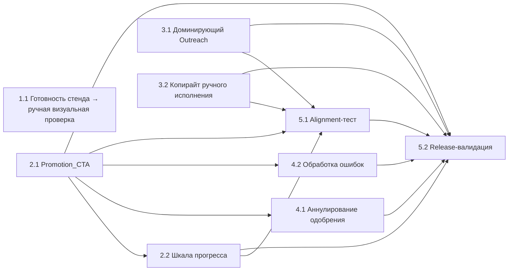

# Implementation Plan: dispatcher-flow-connect

## Overview

Узкий продуктовый срез, связывающий стабилизированный диспетчерский
воркбенч (`LocalServicesDispatchDemoPanel`) с уже существующими
поверхностями `Launch_Path_7min`, `Launch_Packet` и
`Outreach_Execution_Pack` через ровно один новый строковый маркер
`Promotion_CTA` и одну локальную шкалу прогресса в зоне
`Launch packet readiness card`. Срез сознательно реверсивен:
правки идут только в трёх именованных якорях файла
`apps/demo-frontend/app-shell/src/components/workspace/LiveDesk.tsx`
и в одном существующем тесте
`tests/unit/demo-frontend-app-shell-runtime-alignment.test.ts`.
Новые файлы не создаются. Layout-слой не трогается. PBT в этом срезе
не применяется (см. design.md → Testing Strategy: UI overlay поверх
уже зафиксированных чистых функций).

## Cross-cutting Rules

Эти правила обязательны для каждой задачи ниже и не должны нарушаться
ни при одном изменении в рамках среза:

- Каждая задача завершается одним PR / одним commit-набором; правки
  кода и правки `tests/unit/demo-frontend-app-shell-runtime-alignment.test.ts`
  попадают в этот же commit-набор (R5.2, R5.5).
- Никаких автономных таймеров, ретраев, экспоненциальных ожиданий,
  фоновых переходов, сторонних эффектов CRM/календаря/биллинга (R3.3).
- Layout-слой `Dispatcher_Workspace` НЕ редактируется ни в одной из
  задач, даже если она трогает `LocalServicesDispatchDemoPanel`
  (R6, design.md → Layout Invariants Preserved).
- Запрещено вводить новые `Release_KPI_Gate` в
  `scripts/release-readiness.ps1`,
  `scripts/demo-e2e-policy-check.mjs` и схемах release-артефактов
  (R8.5, design.md → Testing Strategy → Слой 3).
- Запрещено менять `apps/demo-frontend/app-shell/src/lib/local-services-workspace-adapter.ts`,
  `apps/demo-frontend/app-shell/src/lib/local-services-scenarios.ts`,
  `apps/api-backend/src/local-services-workspace.ts`,
  `apps/api-backend/src/index.ts` и какие-либо файлы спека
  `multimodal-agents`.
- Новые файлы НЕ создаются — срез только расширяет существующие.
- Каждая задача завершается строкой Definition of Done:
  «DoD: соответствующие критерии прошли, alignment-тест зелёный,
  layout-инварианты сохранены.»

## Tasks

- [x] 1. Операционная готовность локального стенда

  - [x] 1.1 Прогреть `Local_Stack` и подтвердить четыре `/healthz`
    - Запустить локальный стек до начала любой ручной визуальной проверки.
    - Убедиться, что каждый из эндпоинтов
      `http://localhost:3000/healthz`, `http://localhost:8080/healthz`,
      `http://localhost:8081/healthz`, `http://localhost:8082/healthz`
      возвращает HTTP 200 не дольше 5000 мс на запрос.
    - Зафиксировать результат как предусловие визуальной проверки;
      при первой неудаче — пометить визуальную проверку как
      «НЕ ЗАВЕРШЕНА» с указанием первого упавшего эндпоинта.
    - **Эта задача — операционная и гейтит ТОЛЬКО ручную визуальную
      проверку среза. Она НЕ является зависимостью ни одной из
      кодовых задач 2.1–5.2 ниже.**
    - _Requirements: R7.1, R7.2, R7.3, R7.4_
    - _Design: Local Stack Precondition (Operational), Testing Strategy → Слой 2_
    - DoD: соответствующие критерии прошли, alignment-тест зелёный, layout-инварианты сохранены.

- [x] 2. Связка диспетчера с продуктовым потоком

  - [x] 2.1 Ввести единственный `Promotion_CTA` в `LocalServicesDispatchDemoPanel`
    - В якоре `LocalServicesDispatchDemoPanel`
      (`LiveDesk.tsx`, ~7216) ввести ровно один новый строковый маркер
      `Promotion_CTA` (токен присутствует в тексте/`aria-label`).
    - Разместить CTA в зоне первого экрана на `Default_Demo_Route`
      (`?demo=local-services-dispatch&service=ac-repair-dispatch`)
      без открытия drawer/modal/popover/accordion до факта активации.
    - Отличить CTA от соседних действий тремя признаками одновременно:
      площадь кликабельной зоны ≥ 1.5× от любого соседнего действия,
      первый порядок чтения внутри своего контейнера, копирайт совпадает
      с токеном маркера.
    - При активации вызвать существующий `onOpenPath("7min")` так,
      чтобы перейти в `path=7min&view=requests` за ≤1000 мс.
    - НЕ вводить альтернативных CTA на `Launch_Path_7min /
      Launch_Packet / Outreach_Execution_Pack`. НЕ редактировать
      layout-слой.
    - _Requirements: R1.2, R1.4, R2.1, R2.2, R2.5_
    - _Design: Components and Interfaces → LocalServicesDispatchDemoPanel, Marker Contract_
    - DoD: соответствующие критерии прошли, alignment-тест зелёный, layout-инварианты сохранены.

  - [x] 2.2 Отразить прогресс пути в `Launch packet readiness card`
    - В существующей зоне `Launch packet readiness card` внутри
      `LocalServicesDispatchDemoPanel` (`LiveDesk.tsx`, ~10433–10443)
      отобразить три шага `Launch_Path_7min → Launch_Packet →
      Outreach_Execution_Pack`.
    - Состояние шагов хранить только в памяти компонента в форме
      `PromotionProgressState` (`steps: Record<PromotionStepId,
      PromotionStepStatus>`, статусы `idle | active | completed |
      blocked`) — без записи в snapshot рабочего пространства,
      без новых API-полей, без таймеров.
    - После смены текущего шага обновлять отрисовку за ≤1000 мс
      (достаточно `requestAnimationFrame`).
    - НЕ редактировать layout-слой и не вводить дополнительных CTA.
    - _Requirements: R2.6, R3.5_
    - _Design: Components and Interfaces → Launch packet readiness card, Data Models_
    - DoD: соответствующие критерии прошли, alignment-тест зелёный, layout-инварианты сохранены.

- [x] 3. Доминирующие переходы и копирайт ручного исполнения

  - [x] 3.1 Сохранить ровно один доминирующий `Open outreach execution pack`
    - В якоре `LocalServicePilotLaunchPacketSections`
      (`LiveDesk.tsx`, ~16663) убедиться, что в активном экране
      присутствует ровно одна доминирующая кнопка с маркером
      `Open outreach execution pack`.
    - При обнаружении дублирующих переходов в
      `Outreach_Execution_Pack` — удалить или понизить их визуальный
      вес; вторичные ссылки внутри секций других экранов не трогать.
    - НЕ вводить новых CTA, не переименовывать существующий маркер,
      не редактировать layout-слой.
    - _Requirements: R2.3, R2.4_
    - _Design: Components and Interfaces → LocalServicePilotLaunchPacketSections, Marker Contract_
    - DoD: соответствующие критерии прошли, alignment-тест зелёный, layout-инварианты сохранены.

  - [x] 3.2 Добавить короткую фразу «внешнее исполнение остаётся ручным»
    - В якоре `LocalServicePilotWorkspaceExportDrawer`
      (`LiveDesk.tsx`, ~16910) добавить одну короткую копирайт-строку,
      явно подтверждающую, что внешнее исполнение остаётся ручным.
    - Если в шапке потока `Outreach_Execution_Pack` уже есть
      эквивалентный текстовый блок — расширить его одной фразой,
      не дублируя смысл.
    - Логику экспорта, маршруты, формат payload и существующий
      маркер `Pilot workspace export drawer` НЕ менять.
    - _Requirements: R3.4_
    - _Design: Components and Interfaces → LocalServicePilotWorkspaceExportDrawer, Manual_Approval Invariant_
    - DoD: соответствующие критерии прошли, alignment-тест зелёный, layout-инварианты сохранены.

- [x] 4. Инвариант ручного одобрения и обработка ошибок

  - [x] 4.1 Аннулировать одобрение при изменении данных заявки
    - Внутри `LocalServicesDispatchDemoPanel` реализовать правило
      `lastApprovedCaseRef` из design Data Models: при смене
      `WorkspaceCase.ref` или любого поля текущего `WorkspaceCase`
      статус активного шага `PromotionProgressState` переходит в
      `blocked`, а `Promotion_CTA` возвращается в исходное состояние.
    - Повторное одобрение получать через существующий
      `updateCaseDecision(ref, decision)`; новых точек записи
      решения не вводить.
    - Никакой новой персистенции: `lastApprovedCaseRef` живёт только
      в локальном состоянии компонента.
    - НЕ редактировать layout-слой,
      `local-services-workspace-adapter.ts` и
      `local-services-scenarios.ts`.
    - _Requirements: R3.1, R3.2, R3.5_
    - _Design: Data Models, Manual_Approval Invariant_
    - DoD: соответствующие критерии прошли, alignment-тест зелёный, layout-инварианты сохранены.

  - [x] 4.2 Реализовать четыре ветки ошибок навигации
    - Недопустимый `service` (R4.2): отклонить значение, показать
      сообщение об ошибке с указанием недопустимого значения,
      переключиться на `Default_Demo_Route` без сохранения отклонённого.
    - Отсутствующее/повреждённое/неподдерживаемое `path|view|packet`
      (R2.7): вернуть оператора к `Promotion_CTA`, показать сообщение
      об ошибке навигации, ранее зафиксированный прогресс шагов
      сохранить.
    - Таймаут перехода >5000 мс в `Launch_Path_7min`,
      `Launch_Packet` или `Outreach_Execution_Pack` (R2.8): отменить
      переход, оставить оператора на исходном экране, показать ошибку
      с возможностью повторной активации `Promotion_CTA`.
    - Недоступность `Local_Stack` на `Default_Demo_Route` (R1.6):
      показать состояние загрузки/ошибки с идентификацией
      недоступности стенда, сохранив структурную последовательность
      `request → decision → approval → handoff/export`.
    - Никаких ретраев, фоновых таймеров и автономных переходов.
    - _Requirements: R1.6, R2.7, R2.8, R4.2_
    - _Design: Error Handling, Manual_Approval Invariant_
    - DoD: соответствующие критерии прошли, alignment-тест зелёный, layout-инварианты сохранены.

- [x] 5. Тесты и валидационные ворота

  - [x] 5.1 Расширить alignment-тест аддитивно
    - В существующем
      `tests/unit/demo-frontend-app-shell-runtime-alignment.test.ts`
      добавить `assert.match` строки для маркеров из design
      «Marker Contract» (`Promotion_CTA`,
      `Launch packet readiness card`, `Launch packet bridge`,
      `Open outreach execution pack`, `Pilot workspace export drawer`,
      `Main dispatcher compact queue`,
      `Main dispatcher full-height decision rail`,
      `Selected request decision rail`) — только для тех, которых
      в файле ещё нет.
    - Добавить проверку уникальности: `Promotion_CTA` встречается
      ровно один раз в исходнике `LiveDesk.tsx` вне комментариев
      (использовать счётчик вхождений строки/regex в стиле, уже
      применяемом в этом тесте).
    - Только аддитивные правки; существующие утверждения не
      переписывать. Новых тестовых файлов не создавать.
    - _Requirements: R5.1, R5.3, R5.4_
    - _Design: Marker Contract, Testing Strategy → Слой 1_
    - DoD: соответствующие критерии прошли, alignment-тест зелёный, layout-инварианты сохранены.

  - [x] 5.2 Прогнать release-валидационные ворота без новых KPI
    - Выполнить `npm run test:unit` (код выхода 0, без проваленных
      и пропущенных тестов).
    - Выполнить `npm run build` (код выхода 0, без ошибок компиляции).
    - Если в commit-наборе затронуты release-артефакты
      (`summary.json`, `badge-details.json` и т.п.) — дополнительно
      выполнить `npm run verify:release` (код выхода 0).
    - Подтвердить, что множество идентификаторов `Release_KPI_Gate`
      (включая `assistantActivityLifecycleValidated`,
      `liveContextCompactionValidated`,
      `operatorStartupDiagnosticsValidated` и KPI телеметрии
      разделения) совпадает с предыдущим состоянием — ни одного
      нового идентификатора не добавлено.
    - При несовпадении кода выхода или появлении нового
      `Release_KPI_Gate` — отметку готовности не присваивать.
    - _Requirements: R8.1, R8.2, R8.3, R8.4, R8.5_
    - _Design: Testing Strategy → Слой 3_
    - DoD: соответствующие критерии прошли, alignment-тест зелёный, layout-инварианты сохранены.

## Не входит в этот срез

Следующие пункты исключены дословно из `requirements.md` (раздел
«Out of Scope») и не должны проникать в этот срез ни как требования,
ни как элементы дизайна, ни как задачи реализации:

1. Миграция состояния `local-services-workspace` на durable-БД.
2. Реальная интеграция с Telegram.
3. Интеграция с телефонией/SIP.
4. Экспорт в Google Sheets или CRM.
5. Синхронизация календаря/расписания.
6. MCP-коннектор и MCP-сервер.
7. Гейтинг доступа к `/dev` по ролям.
8. Расширенная аналитическая страница.
9. Marketplace-плитки и интеграционные витрины.
10. Login/billing/security-heavy SaaS-оболочка.
11. Любая автономная отправка, диспетчеризация, бронирование, запись в CRM
    или биллинг без `Manual_Approval`.
12. Введение новых `Release_KPI_Gate` в release-валидации.
13. Расширение скоупа на вертикали электрики, стройматериалов, ресторанов,
    отелей и стоматологии.
14. Редизайн стабилизированного layout диспетчера (двухколоночная
    раскладка, breakpoint 1600px, ширины рейла и полосы действий).

## Notes

- PBT-задачи в этом срезе отсутствуют сознательно: design.md →
  Testing Strategy явно объясняет, что изменение сводится к одному
  строковому маркеру и одной локальной UI-шкале поверх уже
  зафиксированных чистых функций.
- Файлы `apps/demo-frontend/app-shell/src/lib/local-services-workspace-adapter.ts`,
  `apps/demo-frontend/app-shell/src/lib/local-services-scenarios.ts`,
  `apps/api-backend/src/local-services-workspace.ts`,
  `apps/api-backend/src/index.ts` и спек `multimodal-agents` в
  пределах этого среза неприкосновенны.
- Рабочий процесс этого спека — только артефакты планирования.
  Реализация выполняется отдельно: открыть `tasks.md` и нажать
  «Start task» рядом с нужным пунктом.

## Task Dependency Graph

Задача 1.1 — операционная и гейтит только ручную визуальную проверку,
поэтому помещена в нулевую волну отдельно от кодовых задач и не
блокирует ни одну из задач 2.1–5.2. Задачи 3.1 и 3.2 независимы и
могут выполняться параллельно с 2.1.

```json
{
  "waves": [
    { "id": 0, "tasks": ["1.1", "2.1", "3.1", "3.2"] },
    { "id": 1, "tasks": ["2.2", "4.1", "4.2"] },
    { "id": 2, "tasks": ["5.1"] },
    { "id": 3, "tasks": ["5.2"] }
  ]
}
```


