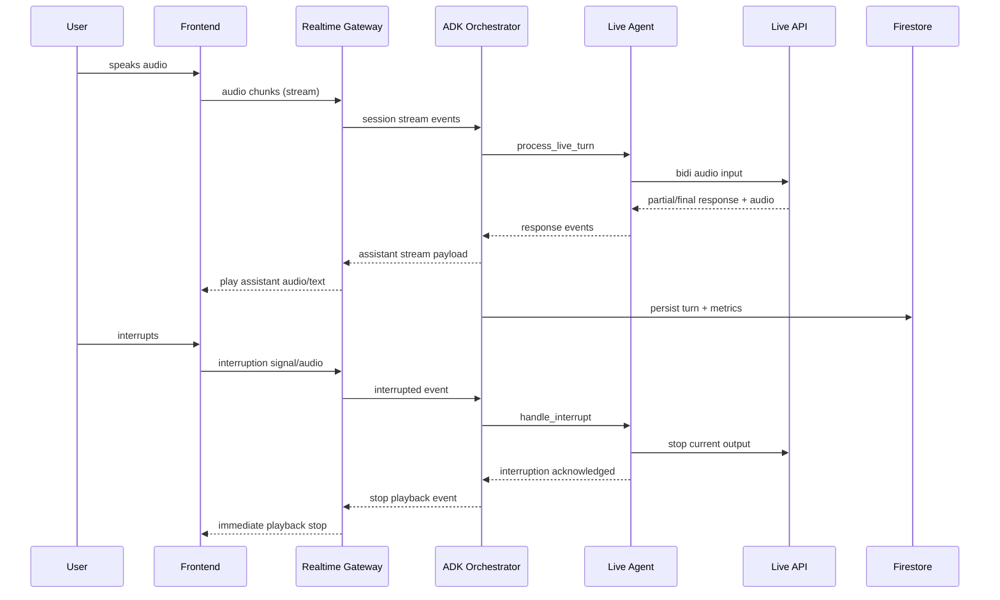
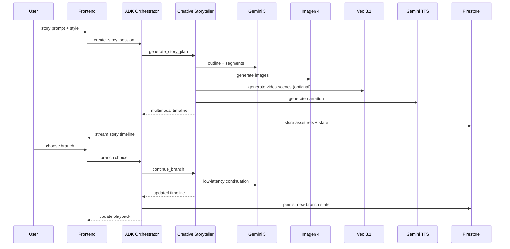
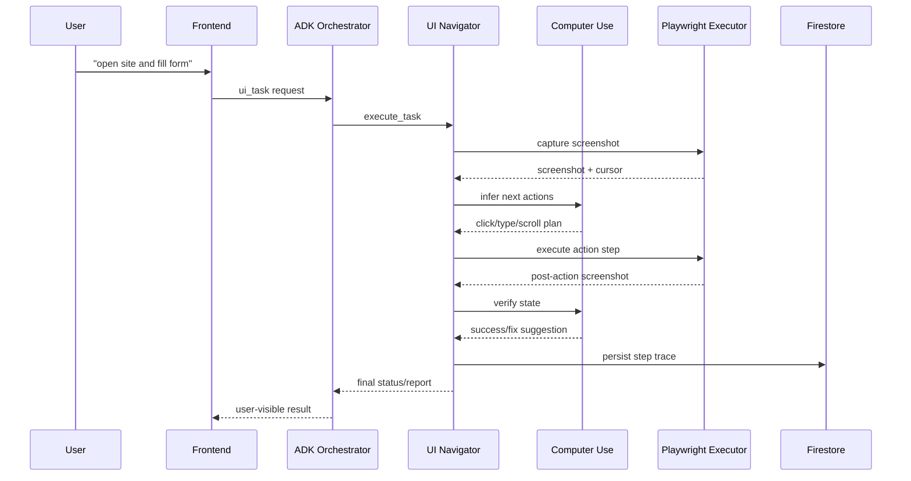
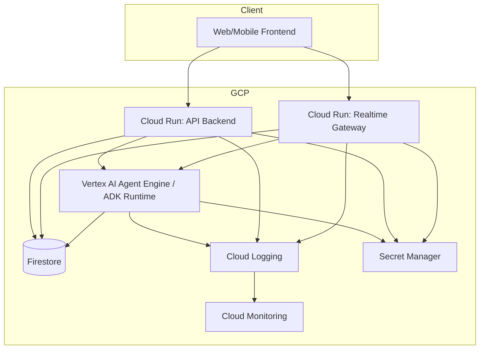

# Design Document

## Overview

Этот документ описывает целевую архитектуру системы "Агенты нового поколения" для трёх направлений:

- Live Agent (real-time voice/video + interruption + translation + negotiation)
- Creative Storyteller (text/audio/image/video storytelling)
- UI Navigator (Computer Use + browser/native action execution)

Дизайн синхронизирован с:

- `.kiro/specs/multimodal-agents/requirements.md`
- `.kiro/specs/multimodal-agents/tasks.md`

## Design Goals

1. Минимальный production-ready MVP за 2 недели (челлендж-фокус).
2. Ядро на Google stack: ADK + Live API + Gemini + Google Cloud.
3. Низкая задержка в real-time voice path и надежная деградация.
4. Прозрачность действий агентов: audit, traces, approvals.
5. Чёткое разделение доменных агентов и orchestration слоя.

## Non-Goals (MVP)

1. Полноценный multi-channel messaging gateway (Slack/Telegram/Discord) в первой версии.
2. Крупный plugin marketplace и public skill registry.
3. Полная enterprise multi-tenant governance модель.

## High-Level Architecture

```mermaid
flowchart LR
    U[User Web/Mobile Client] --> FE[Frontend: WebSocket UI (MVP)]
    FE --> GW[Realtime Gateway Service]
    GW --> ORCH[ADK Orchestrator]

    ORCH --> LA[Live Agent]
    ORCH --> CS[Creative Storyteller]
    ORCH --> UIA[UI Navigator]

    LA --> LAPI[Live API]
    LA --> G3F[Gemini 3 Flash]
    LA --> G3P[Gemini 3 Pro]

    CS --> G3P
    CS --> G3F
    CS --> IMG[Imagen 4]
    CS --> VEO[Veo 3.1]
    CS --> TTS[Gemini TTS]

    UIA --> CUT[Computer Use Tool]
    UIA --> BRW[Playwright Executor]

    ORCH --> FS[(Firestore)]
    GW --> LOG[Cloud Logging/Monitoring]
ORCH --> LOG
```

MVP Transport Baseline

1. WebSocket is the only required transport in MVP.
2. WebRTC remains a V2 enhancement and is intentionally excluded from judged demo critical path.

## Runtime Components

### 1. Frontend Client

Responsibilities:

1. Захват микрофона/камеры и отправка realtime потока.
2. Рендер голоса агента, текстовых транскриптов, карточек действий.
3. UI для approval sensitive actions.
4. Отображение story timeline и UI Navigator trace.

Interfaces:

- `wss://.../realtime` for live control/data (session is carried in envelope as `sessionId`).
- REST endpoints для history/assets/reports.

### 2. Realtime Gateway Service (Cloud Run)

Responsibilities:

1. Терминирование клиентских WebSocket сессий (WebRTC - deferred to V2).
2. Session auth, rate limits, reconnect protocol.
3. Маршрутизация событий в ADK Orchestrator.
4. Backpressure control и stale frame dropping.

Key behaviors:

1. Поддержка stateful session binding (user/session/device).
2. Таймауты и heartbeat на каждую сессию.
3. Стандартизированные envelope-сообщения для frontend.
4. Сквозной correlation context (`userId/sessionId/runId`) и websocket mismatch-protection (`sessionId`, `userId`).
5. Явные runtime transitions для UI через `session.state` events (`session_bound`, `orchestrator_dispatching`, `orchestrator_completed/failed`).
6. Пер-сессионная serial-lane обработка входящих websocket сообщений для исключения race-condition между live/orchestrator событиями.
7. Idempotent replay для duplicate `orchestrator.request` в gateway (TTL cache) и orchestrator (in-flight + completed dedupe).

### 3. ADK Orchestrator

Responsibilities:

1. Централизованная оркестрация агентов и инструментов.
2. Delegation между Live Agent, Storyteller и UI Navigator.
3. Policy checks (sensitive actions, confirmation gates).
4. Persistence hooks в Firestore и trace emission.

Routing policy (MVP):

1. `intent=conversation/translation/negotiation` -> Live Agent.
2. `intent=story` -> Creative Storyteller.
3. `intent=ui_task` -> UI Navigator.
4. Complex request -> primary agent + delegated subtask.

### 4. Domain Agents

#### Live Agent

Responsibilities:

1. Realtime conversational loop через Live API.
2. Native interruption handling (`interrupted` events).
3. Translation mode и negotiation mode.
4. Session memory sync в Firestore/Session store.
5. Automatic context compaction (summary + recent turns) when token budget is exceeded.

Core model split:

1. Live turn/audio: Gemini Live profile.
2. Fast reasoning: `gemini-3-flash`.
3. Deep negotiation/planning: `gemini-3-pro`.

#### Creative Storyteller

Responsibilities:

1. Планирование сюжетной структуры.
2. Генерация ветвлений истории на decision points.
3. Интеграция Imagen 4/Veo 3.1/Gemini TTS.
4. Timeline synchronization для multimodal playback.

#### UI Navigator

Responsibilities:

1. Computer Use reasoning по screenshot context.
2. Генерация action sequence и исполнение через Playwright.
3. Self-correction loop (post-action verify screenshot).
4. Sensitive action blocking + user confirmation.
5. Visual testing mode with structured regression report (`layout/content/interaction`, severity, baseline/actual/diff refs).

## Sequence Flows

### Flow A: Live Conversation with Interruption



### Flow B: Story Generation and Branching



### Flow C: UI Task with Computer Use and Self-Correction



## Data Model (Firestore)

### Collections

1. `sessions`
2. `events`
3. `agent_runs`
4. `negotiation_logs`
5. `story_assets`
6. `ui_traces`
7. `approvals`
8. `metrics_rollups`

### Document Schemas (MVP)

#### `sessions/{sessionId}`

```json
{
  "userId": "string",
  "agentMode": "live|story|ui|multi",
  "status": "active|paused|closed",
  "language": "string",
  "createdAt": "timestamp",
  "updatedAt": "timestamp",
  "version": "number",
  "lastMutationId": "string|null",
  "lastMutationStatus": "active|paused|closed",
  "lastRunId": "string"
}
```

#### `events/{eventId}`

```json
{
  "sessionId": "string",
  "runId": "string",
  "source": "frontend|gateway|orchestrator|agent|tool",
  "type": "event_type",
  "payload": {},
  "createdAt": "timestamp"
}
```

#### `agent_runs/{runId}`

```json
{
  "sessionId": "string",
  "agent": "live|storyteller|ui_navigator",
  "status": "accepted|running|completed|failed|canceled",
  "latencyMs": 0,
  "modelProfile": "string",
  "errorCode": "string|null",
  "createdAt": "timestamp",
  "finishedAt": "timestamp|null"
}
```

#### `ui_traces/{traceId}`

```json
{
  "sessionId": "string",
  "runId": "string",
  "task": "string",
  "steps": [
    {
      "index": 1,
      "action": "click|type|scroll|hotkey",
      "target": "string",
      "status": "ok|retry|failed",
      "screenshotRef": "string",
      "createdAt": "timestamp"
    }
  ],
  "finalStatus": "completed|failed|needs_approval"
}
```

### Indexing Strategy

1. `sessions` by `userId + updatedAt desc`.
2. `events` by `sessionId + createdAt`.
3. `agent_runs` by `sessionId + createdAt` and `status`.
4. `ui_traces` by `sessionId + runId`.

### Retention Strategy

1. Raw media references: short retention (policy-driven).
2. Audit logs (`events`, `approvals`, `agent_runs`): extended retention.
3. Metrics rollups: long retention for trend analysis.

## Deployment Topology (Vertex AI + Cloud Run)



### Service Roles

1. Cloud Run Realtime Gateway:
   - client streaming ingress/egress
   - connection/session lifecycle
2. Cloud Run API Backend:
   - management APIs (sessions/history/reports/assets)
   - auth and policy endpoints
3. Vertex AI Agent Engine (or ADK runtime on Cloud Run):
   - orchestration + domain agent execution
   - tool routing and multi-agent delegation

### Environment Promotion

1. `dev`: fast iteration, relaxed quotas.
2. `staging`: production-like config and load checks.
3. `prod`: strict policies, alerting, retention enforcement.

## Security and Policy Architecture

### AuthN/AuthZ

1. User auth: token-based auth at API/Gateway boundary.
2. Service auth: IAM service accounts and least privilege.
3. Agent action auth: policy guard before sensitive tools.

### Sensitive Action Protection

1. UI Navigator marks risky actions (`payment`, `credential submission`, `destructive`).
2. Orchestrator creates `approval` record and pauses execution.
3. Frontend asks user confirmation.
4. Execution resumes only after signed approval event.

### Data Protection

1. TLS for in-transit communications.
2. Encrypted storage at rest.
3. Scoped retention for audio/video and tool artifacts.

## Observability Design

### Metrics

1. Live voice round-trip latency (p50/p95/p99).
2. Interruption reaction latency.
3. Tool success/failure rate by agent/tool type.
4. Model/API error rates and quota pressure.

### Logs

1. Structured logs with `sessionId`, `runId`, `agent`, `eventType`.
2. Correlation IDs propagated across gateway -> orchestrator -> tools.
3. Redaction policy for PII/secrets.

### Alerts

1. Error-rate spike per service.
2. Latency SLO breach.
3. Repeated failure loop for UI task execution.
4. Approval queue timeout.

## Failure Handling and Degradation

1. Live API temporary failure:
   - fallback to text-only response channel.
2. Image/video generation timeout:
   - return partial story with pending media placeholders.
   - expose async media job state (`mediaJobs.video`) linked to segment assets for polling/UI updates.
3. UI action failure:
   - bounded retries + recovery prompt + human confirmation.
4. Firestore transient errors:
   - exponential backoff and eventual consistency markers.
5. Demo-time media degradation (Imagen/Veo unavailable or slow):
   - switch to pre-generated media fallback pack with explicit UI marker (`fallback_asset=true`).

## Skills Runtime (V2-Oriented Extension Point)

MVP хранит это как extension point без полной реализации registry:

1. `skills/` directory in workspace.
2. `SKILL.md` metadata parsing for eligibility and policy.
3. optional install-time scanners.
4. controlled env injection via policy allowlist.

Это позволяет позже подключить managed registry без изменения core архитектуры.

## Borrowed Patterns from Voicebox (Adapted to Gemini/ADK)

This section captures practical patterns inspired by the open-source Voicebox repository
and adapts them to this project's required stack (ADK + Live API + Gemini + Google Cloud).

Adoption rule:

1. Reuse architectural patterns and operational workflows.
2. Do not replace the challenge baseline model/runtime stack.
3. Preserve security and production constraints (auth, IAM, auditability, approvals).

Reference: `https://github.com/jamiepine/voicebox` (MIT license).

### MVP (Adopt Now)

1. Active task registry + progress streaming
   - Keep a unified in-memory task registry for long operations (`story media generation`, `ui navigation runs`, `bulk export`).
   - Emit progress/status events through the existing realtime channel for frontend visibility.
   - Persist final task outcome to Firestore for audit and replay.

2. Model/runtime lifecycle operations
   - Add explicit runtime operations in backend APIs: `status`, `warmup`, `drain`, `health`, `version`.
   - Use these operations for controlled rollouts and incident recovery in Cloud Run / Agent Engine runtimes.
   - Expose runtime profile in traces for reproducibility.

3. Provider-style adapter boundary (within Google stack)
   - Define an internal adapter interface per capability (`live`, `reasoning`, `tts`, `image`, `video`, `computer_use`).
   - Keep Gemini/Vertex implementations as default adapters.
   - Use adapter boundary to support safe profile switching and fallback without changing business logic.
   - Current baseline implementation uses `@mla/capabilities` (`shared/capabilities`) and propagates `capabilityProfile` in orchestrator responses for audit/debug.

4. Remote execution split
   - Keep frontend lightweight and state-aware; run agent orchestration and tool execution only on backend services.
   - Maintain strict session binding (`userId`, `sessionId`, `runId`) across gateway and orchestrator.
   - Surface connection and execution state transitions to UI in near-real time.

5. API schema discipline
   - Maintain a single source of truth for REST/WebSocket contracts.
   - Generate typed client bindings from schema for frontend/backend consistency.
   - Include trace IDs and normalized error envelopes in all responses.

### Post-MVP (Adopt Later)

1. Advanced background workers for media pipelines
   - Baseline implemented: dedicated async worker slots with quota-aware scheduling, retry budget, and DLQ tracking for storyteller media jobs.
   - Next step: move queue execution to dedicated Cloud Run worker service with managed queue trigger and resume/replay controls.

2. Extended caching and artifact reuse
   - Baseline implemented: deterministic story cache keys for plan/branch/asset variants with TTL+capacity limits.
   - Baseline implemented: policy invalidation on cache fingerprint change (`model/version`) and manual purge token rotation.
   - Next step: move cache store to shared/distributed backend for multi-instance consistency.

3. Optional local-first development profile
   - Baseline implemented: local-first profile with service-level guardrails (`APP_ENV`, `RUNTIME_PROFILE`/`LOCAL_FIRST_PROFILE`).
   - Baseline implemented: automatic non-production defaults for offline iteration (Firestore/Live API/Gemini planner off, simulation-first adapters).
   - Guardrail blocks local-first outside `dev`.

4. Rich operational console
   - Baseline implemented: operator summary APIs for active tasks, approval queue snapshots, per-service health/runtime profile status, and execution trace rollups (runs/events/tool steps/screenshots/approval links).
   - Baseline implemented: role-gated recovery actions (`cancel_task`, `retry_task`, `failover drain/warmup`) with operator action audit trail visible in console summary.
   - Next step: add full UI audit timeline and richer incident automation controls.

5. Sandbox policy modes for UI execution
   - Baseline implemented: `off/non-main/all` policy modes with request override support for controlled test scenarios.
   - Baseline implemented: sandbox restrictions for max-steps caps, action-type allowlists, blocked high-risk categories, and optional forced executor mode.
   - Baseline implemented: sandbox policy metadata is emitted in UI agent output and validated by demo policy (`sandboxPolicyValidated`).

6. Profile-aware live failover policy
   - Baseline implemented: failover reason classification (`transient`, `rate_limit`, `auth`, `billing`) in live bridge retry loop.
   - Baseline implemented: model/auth route state with cooldowns and billing/auth disable windows, plus automatic route re-selection.
   - Baseline implemented: failover diagnostics expose reason class and route readiness in gateway events for operator/debug workflows.

### Explicitly Out of Baseline Scope

1. Replacing ADK orchestration with a non-ADK runtime core.
2. Replacing Gemini/Live API with non-Gemini primary models for core challenge flows.
3. Shipping unauthenticated public APIs (local-only assumptions are not valid for production deployment).
4. Importing third-party code paths without security review, policy checks, and license attribution.

## Resolved Decisions (ADR)

1. Media binary storage in MVP: `.kiro/specs/multimodal-agents/adr/ADR-001-media-storage-baseline.md`
2. Transport baseline in MVP: `.kiro/specs/multimodal-agents/adr/ADR-002-transport-baseline.md`
3. Long-running media jobs strategy: `.kiro/specs/multimodal-agents/adr/ADR-003-media-job-runner.md`
4. Approval SLA and timeout policy: `.kiro/specs/multimodal-agents/adr/ADR-004-approval-sla.md`

## Challenge Demo Controls (Hybrid 80/20)

Этот блок фиксирует обязательные элементы для judged demo сценария
`Live Translator Negotiator` (flagship category: Live Agent).

### Demo Scope

1. Primary category: Live Agent.
2. Scenario: B2B negotiation with real-time translation `English <-> Russian`.
3. Risk profile: Balanced.
4. Demo duration target: 5-6 minutes.
5. Main KPI set: `price`, `delivery`, `SLA`.

### Mandatory On-Screen Controls

1. The demo UI SHALL display starting constraints before negotiation begins:
   `price <= target`, `delivery <= target`, `SLA >= target`.
2. The demo UI SHALL show a live KPI panel:
   `target vs current offer vs final agreement`.
3. The demo UI SHALL show explicit run metadata at completion:
   `runId`, `sessionId`, and final status.

### Reliability Proof Plan

1. The live script SHALL include two planned interruption checkpoints:
   one soft interruption and one hard interruption.
2. After each interruption, THE System SHALL continue negotiation without losing KPI context.
3. The demo runbook SHALL include exact interruption timestamps and expected recovery behavior.

### Safety and Closing Controls

1. The negotiation policy SHALL enforce hard boundaries from user constraints.
2. WHEN final offer violates constraints, THE System SHALL refuse to close the deal and explain why.
3. WHEN final offer satisfies constraints, THE System SHALL require explicit user confirmation before completion.
4. The completion screen SHALL show an auditable summary of accepted terms.

### Stage Fallback Plan

1. IF live voice channel quality degrades, THE System SHALL switch to text mode in the same session.
2. The fallback path SHALL preserve negotiation context and KPI state.
3. The fallback transition SHALL be visible in UI as a state change event.
4. The runbook SHALL include a manual operator shortcut to trigger text-mode failover.

### Approval Resume Control

1. The demo UI SHALL expose an explicit `Approval Control` panel for sensitive UI tasks.
2. The panel SHALL allow operator decision `approved/rejected` and invoke `POST /v1/approvals/resume`.
3. The panel SHALL display `approvalId`, decision status, and resumed orchestrator result.
4. Approval records SHALL be queryable through `GET /v1/approvals`.

### UI Executor Adapter

1. UI Navigator SHALL support external `remote_http` execution adapter via dedicated `ui-executor` service.
2. The adapter SHALL expose `POST /execute` and return structured trace steps (`ok/retry/failed`).
3. WHERE Playwright is unavailable in adapter runtime, the adapter SHALL either fail fast (strict mode) or return explicit simulation fallback marker.
4. The execution result SHALL include adapter mode and notes for audit/debug visibility.

### Demo Automation Artifact

1. The repository SHALL include an executable demo smoke script at `scripts/demo-e2e.ps1`.
2. The script SHALL validate end-to-end demo flows: translation, negotiation, storyteller generation, UI approval reject/approve resume, multi-agent delegation, WebSocket gateway roundtrip via `/realtime`, WebSocket task-progress contract behavior (`task.started` + `task.progress` + `/tasks/active`), WebSocket duplicate-request replay contract behavior (`gateway.request_replayed` + single `task.started` + reused response envelope id), WebSocket interruption signal contract behavior (`live.interrupt.requested` or `live.bridge.unavailable`), invalid-envelope error contract behavior (`gateway.error` with traceId), REST contract behavior for invalid approval resume intent (`HTTP 400` + normalized error `API_INVALID_INTENT` + traceId), runtime lifecycle endpoint contract checks (`/status`, `/version`, `/drain`, `/warmup`) for gateway/api/orchestrator, runtime observability checks (`/metrics`) for p95/error-rate visibility, websocket correlation/session-binding checks (`userId/sessionId/runId` + `session.state` transitions), and capability adapter profile coverage (`kpi.capabilityAdaptersValidated`).
3. The script SHALL produce structured reports at `artifacts/demo-e2e/summary.json` and `artifacts/demo-e2e/summary.md` with per-scenario pass/fail and KPI fields.
4. The script SHALL support local run modes for CI/demo prep (`-SkipBuild`, `-SkipServiceStart`, `-KeepServices`, `-OutputPath`).
5. The repository SHALL include CI automation (`.github/workflows/demo-e2e.yml`) that executes demo e2e and publishes `summary.json`, `summary.md`, and logs as build artifacts.
6. The repository SHALL include PR gating template (`.github/pull_request_template.md`) with mandatory demo-readiness checklist linked to e2e KPIs and artifacts.
7. The repository SHALL enforce an automated KPI policy gate (`scripts/demo-e2e-policy-check.mjs`) that fails CI when key demo constraints regress.
8. KPI policy execution SHALL publish both human-readable (`policy-check.md`) and machine-readable (`policy-check.json`) artifacts for reviewers and automation.
9. The CI pipeline SHALL generate Shields-compatible endpoint badge artifact (`badge.json`) from KPI policy output for external status visualization.
10. On `main/master` pushes, CI SHALL publish public badge endpoint files to `gh-pages` at `demo-e2e/badge.json` for external status embedding.
11. The repository SHALL provide operator scripts to configure GitHub Pages source and verify public badge endpoint availability (`badge:pages:enable`, `badge:pages:check`).
12. The repository SHALL provide scripted release operations for local quality gate execution and repository publish orchestration (`verify:release`, `repo:publish`).
13. The repository SHALL provide a judge-facing walkthrough runbook with exact interruption checkpoints and text fallback procedure (`docs/challenge-demo-runbook.md`).
14. The repository SHALL provide automated load/performance scripts (`scripts/perf-load.ps1`, `scripts/perf-load.mjs`, `scripts/perf-load-policy-check.mjs`) with p95/error-budget checks for live voice, UI navigation, and gateway websocket replay/dedupe paths.
15. The orchestrator runtime SHALL expose storyteller media queue visibility (`/story/media-jobs/queue` and `storytellerMediaJobs` in `/metrics`) for operator diagnostics.
16. The orchestrator runtime SHALL expose storyteller cache visibility and invalidation controls (`/story/cache`, `/story/cache/purge`, `storytellerCache` in `/metrics`) for deterministic asset/prompt reuse policy operations.
17. Runtime services SHALL expose applied runtime profile metadata (`runtime.profile`) and enforce local-first guardrails that block non-dev startup.
18. The API backend SHALL expose operator console endpoints (`/v1/operator/summary`, `/v1/operator/actions`) with role-gated recovery controls and cross-service status aggregation.
19. The repository SHALL define a single authoritative WebSocket protocol and error taxonomy document for frontend/gateway integration (`docs/ws-protocol.md`).

## Traceability Matrix

| Design Area | Requirements | Tasks |
| --- | --- | --- |
| Core stack + orchestration | R0, R10, R11 | T-001..T-005, T-012, T-013, T-014 |
| Live realtime | R1, R2, R12 | T-005..T-008 |
| Storyteller pipeline | R4, R5 | T-101, T-102, T-103, T-104, T-112 |
| UI Navigator + Computer Use | R6, R7, R8, R9 | T-105..T-108 |
| Multi-agent delegation | R16 | T-109 |
| Security/monitoring | R13, R15 | T-009, T-107 |
| Story media workers + queue visibility | R4, R10, R15 | T-103, T-207 |
| Story cache + invalidation policy | R4, R5, R15 | T-208 |
| Local-first runtime profile + guardrails | R10, R14 | T-209 |
| Operator console + recovery actions | R13, R15 | T-210 |
| Perf/load quality gate | R1, R6, R12, R14, R15 | T-206 |
| Borrowed-pattern hardening (post-MVP) | R10, R14, R15 | T-201..T-205 |
| Demo frontend + controls | R1, R3, R14, R15 | T-000, T-110, T-111 |
| Live bridge failover + channel watchdog | R1, R12, R15 | T-211 |
| UI loop protection + approval SLA lifecycle | R6, R7, R8, R13, R15 | T-212, T-213 |
| WS protocol discipline + targeted unit pack | R14, R15 | T-214, T-215 |
| Session optimistic versioning + idempotent mutation replay | R14, R15 | T-216 |
| Live-agent context compaction runtime | R1, R10, R15 | T-217 |
| Gateway/Orchestrator idempotent replay + serial lane hardening | R12, R14, R15 | T-218 |
