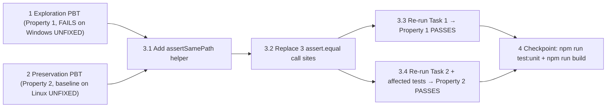

# Implementation Plan: release-evidence-report-windows-shortpath

## Overview

Bugfix slice that resolves two `assert.equal` path-comparison failures in
`tests/unit/release-evidence-report.test.ts` on the GitHub Actions
`windows-2025` runner image. The two failing tests compare paths that
resolve to the same physical filesystem entry but are spelled in different
forms (Windows 8.3 short-name `RUNNER~1` vs long-name `runneradmin`). The
fix is purely in the test layer: introduce a local `assertSamePath` helper
that canonicalizes both sides through `fs.realpathSync` before comparing,
and replace exactly three textual `assert.equal` path comparisons with the
new helper. The production script `scripts/release-evidence-report.ps1` is
NOT modified; Linux behavior is unchanged because `fs.realpathSync` is a
no-op for symlink-free paths.

Tasks follow the bugfix workflow ordering: exploration PBT first (proves
the bug condition exists on Windows), preservation PBT next (records the
non-bug input behavior to preserve), then the fix in three sub-tasks
(helper, three call-site replacements, re-validation), then a final
validation checkpoint (`npm run test:unit`, `npm run build`).

## Cross-cutting Rules

These constraints apply to every task and MUST NOT be violated:

- Do NOT modify `scripts/release-evidence-report.ps1` (production script
  untouched; canonical-form path output unchanged).
- Do NOT add platform-specific branching inside any production-affecting
  assertion. The helper handles both platforms uniformly.
- Do NOT skip the two affected tests on Windows. The fix must make them
  pass on both platforms.
- Do NOT modify any test file other than
  `tests/unit/release-evidence-report.test.ts`.
- Do NOT introduce a `fast-check` dependency. `fast-check` is not currently
  a dev dependency of this repo; PBT generators in tasks 1 and 2 are
  hand-rolled over temp directory basenames.
- All Linux behavior of the affected tests, of the rest of the unit suite,
  and of the production script remains exactly as today.
- Each task is atomic and PBT-test-first: exploration and preservation
  PBTs are written and run on UNFIXED code BEFORE the fix is applied.

## Tasks

- [x] 1. Write bug condition exploration test
  - **Property 1: Bug Condition** - Path-Equality Assertion Strategy Survives Windows 8.3 Short-Path Mismatch
  - **CRITICAL**: This test MUST FAIL on unfixed code (on a Windows host) - failure confirms the bug exists
  - **DO NOT attempt to fix the test or the code when it fails**
  - **NOTE**: This test encodes the expected behavior - it will validate the fix when it passes after implementation
  - **GOAL**: Surface counterexamples that demonstrate the textual `assert.equal` strategy rejects same-file paths whose only difference is Windows 8.3 short-name vs long-name spelling
  - **Scoped PBT Approach**: Because `fast-check` is not a dev dependency in this repo, hand-roll a small generator that produces N (e.g. 8) distinct temp-directory basenames such as `shortpath-pbt-<random-suffix>`; for each generated basename, exercise the property end-to-end. This keeps reproduction concrete and deterministic per run.
  - Add a new `test()` block in `tests/unit/release-evidence-report.test.ts` named approximately `release evidence report path-equality assertion strategy survives Windows 8.3 short-path mismatch (exploratory PBT)`
  - Skip on non-Windows hosts via `if (process.platform !== "win32") { return; }` (no `test.skip` / no `it.skip` - the test body itself short-circuits)
  - On Windows, for each generated basename:
    - Create a real temp dir with `fs.mkdtempSync(path.join(os.tmpdir(), basename))`
    - Compute the 8.3 short-form via `child_process.execSync('cmd /c for %A in ("<longPath>") do @echo %~sA', { encoding: "utf8" }).trim()` with the long path properly quoted
    - If the short form equals the long form textually (filesystem did not produce a distinct 8.3 alias), `console.warn(...)` once and skip the comparison phase for that sample - the bug condition cannot be exercised on this filesystem
    - Otherwise: assert the two forms differ textually, assert `fs.realpathSync(shortForm) === fs.realpathSync(longForm)` (proves they reference the same physical entry)
    - Demonstrate the OLD strategy fails: wrap `assert.equal(shortForm, longForm)` in try/catch and assert it throws `AssertionError`
    - Demonstrate the NEW strategy passes: call `assertSamePath(shortForm, longForm, "shortpath-pbt")` and assert it does NOT throw
  - Clean up each generated temp dir with `fs.rmSync(..., { recursive: true, force: true })`
  - Run test on UNFIXED code
  - **EXPECTED OUTCOME on Windows**: Test FAILS - either at the `assertSamePath` step (helper does not exist yet) or at the OLD-strategy try/catch (textual `assert.equal` rejects same-file paths that differ only in 8.3 spelling); both signals confirm the bug
  - **EXPECTED OUTCOME on Linux**: Test short-circuits and reports as passed (skipped body); this is correct because 8.3 short-path aliasing does not exist on POSIX
  - Document counterexamples found, e.g. `assert.equal("C:\\Users\\RUNNER~1\\AppData\\Local\\Temp\\shortpath-pbt-abc\\probe", "C:\\Users\\runneradmin\\AppData\\Local\\Temp\\shortpath-pbt-abc\\probe") throws AssertionError even though both fs.realpathSync() to the same canonical form`
  - Mark task complete when test is written, run, and the failure (Windows) / skip (Linux) outcome is documented
  - _Requirements: 1.1, 1.2_

- [x] 2. Write preservation property tests (BEFORE implementing fix)
  - **Property 2: Preservation** - Different-File Path Comparison Still Fails; Linux And Non-Path Behavior Unchanged
  - **IMPORTANT**: Follow observation-first methodology - run the UNFIXED `tests/unit/release-evidence-report.test.ts` on Linux, observe and record actual outputs, then write property-based tests that assert those observed outputs across the input domain. Verify tests pass on UNFIXED code before implementing the fix.
  - Observation phase (UNFIXED code, Linux host):
    - Run `npm run test:unit -- tests/unit/release-evidence-report.test.ts` and record that both `release evidence report surfaces hosted direct-live proof in report and manifest` and `release evidence report surfaces case wiki runtime-surface ingress in report manifest and runtime proof` pass on Linux today
    - Record that all non-path assertions (status fields, summary fields, KPI fields, structural fields) in both tests fire and pass exactly as today
    - Record that the rest of `tests/unit/release-evidence-report.test.ts` and the rest of the unit suite is green
  - Add a property-based preservation block to `tests/unit/release-evidence-report.test.ts` that captures the observed Linux behavior for non-bug inputs:
    - Hand-roll a small generator (no `fast-check` dependency) that produces N (e.g. 8) pairs of distinct real files inside a fresh `fs.mkdtempSync(...)` directory; for each pair `(p1, p2)` where `p1 !== p2` after `fs.realpathSync`, assert `assertSamePath(p1, p2, "preservation-distinct")` throws `AssertionError`
    - For each generated pair `(p, p)` where both sides are the same real file, assert `assertSamePath(p, p, "preservation-same")` does NOT throw
    - For a generated `(missing, present)` pair where `missing` does not exist on disk, assert `assertSamePath(missing, present, "preservation-missing")` throws with a readable message that includes the label `"preservation-missing"`
    - Clean up generated temp directories with `fs.rmSync(..., { recursive: true, force: true })`
  - Run preservation tests on UNFIXED code (Linux)
  - **EXPECTED OUTCOME**: Preservation tests fail at the `assertSamePath` step because `assertSamePath` does not exist yet on UNFIXED code - this is the correct signal that the helper introduction in task 3.1 is the change that satisfies them. The observation-phase recording of unmodified existing-test behavior is the baseline that MUST pass on UNFIXED code; that part is documentation of current behavior, not a new test.
  - Document the recorded baseline (existing affected tests pass on Linux UNFIXED, all non-path assertions pass UNFIXED) so it can be re-checked after the fix
  - Mark task complete when the preservation block is written, the baseline observation is recorded, and the existing affected tests are re-confirmed passing on Linux on UNFIXED code
  - _Requirements: 3.1, 3.2, 3.3, 3.4_

- [x] 3. Fix for Windows 8.3 short-path mismatch in release-evidence-report path-equality assertions

  - [x] 3.1 Add the `assertSamePath` local helper at the top of `tests/unit/release-evidence-report.test.ts`
    - Add at the top of the file (after imports, before the first `test()` / `describe()` block)
    - Signature: `function assertSamePath(actual: string, expected: string, label?: string): void`
    - NOT exported (no `export` keyword); scoped to this test file only
    - Implementation: call `fs.realpathSync(actual)` and `fs.realpathSync(expected)`; if either call throws `ENOENT` or any other error, rethrow as a readable `AssertionError`-style error whose message includes `label` (when provided), the side that failed (`actual` or `expected`), the offending input path, and the underlying error code
    - On both `realpathSync` calls succeeding, call `assert.equal(canonicalActual, canonicalExpected)` so the resulting `AssertionError` keeps the standard Node assertion shape that surrounding test infrastructure already understands
    - Add no platform-specific branching - on Linux, `fs.realpathSync` is a no-op for symlink-free paths, so the helper's behavior is identical to `assert.equal` after canonicalization
    - Do NOT modify `scripts/release-evidence-report.ps1` (production script untouched)
    - Do NOT modify any other test file
    - _Bug_Condition: isBugCondition({ actualPath, expectedPath }) - actualPath != expectedPath textually AND fs.realpathSync(actualPath) == fs.realpathSync(expectedPath)_
    - _Expected_Behavior: assertSamePath canonicalizes both sides via fs.realpathSync, then asserts equality of the canonical forms; surfaces a readable error including label if either path does not resolve_
    - _Preservation: Linux behavior unchanged (fs.realpathSync no-op for symlink-free paths); script output unchanged; all other tests unchanged_
    - _Requirements: 2.1, 2.2, 3.1, 3.4_

  - [x] 3.2 Replace the three `assert.equal` path-comparisons with `assertSamePath` in the two affected tests
    - At approximately line 745 (test `release evidence report surfaces hosted direct-live proof in report and manifest`): replace `assert.equal(report.consultationBookingProof.calendarConnector?.approvedBookingArtifactPath, approvedBookingArtifactPath)` with `assertSamePath(report.consultationBookingProof.calendarConnector?.approvedBookingArtifactPath, approvedBookingArtifactPath, "consultationBookingProof.calendarConnector.approvedBookingArtifactPath")`
    - At approximately line 1456 (test `release evidence report surfaces case wiki runtime-surface ingress in report manifest and runtime proof`): replace `assert.equal(report.source.runtimeSurfaceSnapshotPath, runtimeSurfaceSnapshotPath)` with `assertSamePath(report.source.runtimeSurfaceSnapshotPath, runtimeSurfaceSnapshotPath, "report.source.runtimeSurfaceSnapshotPath")`
    - At approximately line 1492 (manifest-side equivalent in the same test): replace the equivalent manifest assertion with `assertSamePath(manifest.source.runtimeSurfaceSnapshotPath, runtimeSurfaceSnapshotPath, "manifest.source.runtimeSurfaceSnapshotPath")`
    - Touch ONLY these three call sites; do NOT touch surrounding non-path assertions (status, summary, KPI, structural fields)
    - Do NOT add `process.platform === "win32"` branching at the call sites - the helper handles both platforms uniformly
    - Do NOT skip the two affected tests on Windows
    - _Bug_Condition: isBugCondition({ actualPath, expectedPath }) for each of the three replaced assertions_
    - _Expected_Behavior: each replaced assertion now passes when both sides reference the same physical filesystem entry (Property 1) and still fails when they reference different entries (Property 2)_
    - _Preservation: surrounding non-path assertions still fire and pass; production script still emits its current canonical-form paths; Linux behavior unchanged_
    - _Requirements: 2.1, 2.2, 3.1, 3.2, 3.3, 3.4_

  - [x] 3.3 Verify bug condition exploration test now passes
    - **Property 1: Expected Behavior** - Path-Equality Assertion Strategy Survives Windows 8.3 Short-Path Mismatch
    - **IMPORTANT**: Re-run the SAME test from task 1 - do NOT write a new test
    - The test from task 1 encodes the expected behavior
    - When this test passes, it confirms `assertSamePath` succeeds for same-file pairs whose only difference is 8.3 short-name vs long-name spelling
    - Run the exploratory PBT block from task 1 via `npm run test:unit -- tests/unit/release-evidence-report.test.ts`
    - **EXPECTED OUTCOME on Windows**: Test PASSES (confirms bug is fixed - `assertSamePath(shortForm, longForm)` does not throw across all generated samples)
    - **EXPECTED OUTCOME on Linux**: Test short-circuits and reports as passed (no behavior change on POSIX)
    - _Requirements: 2.1, 2.2_

  - [x] 3.4 Verify preservation tests still pass
    - **Property 2: Preservation** - Different-File Path Comparison Still Fails; Linux And Non-Path Behavior Unchanged
    - **IMPORTANT**: Re-run the SAME tests from task 2 - do NOT write new tests
    - Run preservation property block from task 2 plus both originally affected tests on Linux via `npm run test:unit -- tests/unit/release-evidence-report.test.ts`
    - **EXPECTED OUTCOME**: Tests PASS (confirms no regressions) - `assertSamePath` throws for distinct-file pairs, throws with the readable label-bearing message for missing paths, and does not throw for same-file pairs; both originally affected tests still pass on Linux with all non-path assertions intact
    - Confirm the rest of `tests/unit/release-evidence-report.test.ts` and the rest of the unit suite is still green (no regressions outside the targeted call sites)
    - _Requirements: 3.1, 3.2, 3.3, 3.4_

- [x] 4. Checkpoint - Ensure all tests pass
  - Run `npm run test:unit` locally and confirm both `release evidence report surfaces hosted direct-live proof in report and manifest` and `release evidence report surfaces case wiki runtime-surface ingress in report manifest and runtime proof` pass on Linux (no behavior change there since `fs.realpathSync` is a no-op for symlink-free paths)
  - Confirm no regressions in the rest of the unit suite
  - Run `npm run build` and confirm it succeeds (no TypeScript or build errors introduced by the new helper, the new PBT block, or the three call-site replacements)
  - Re-confirm `scripts/release-evidence-report.ps1` was NOT modified (production script untouched)
  - Re-confirm no other test file was modified
  - Re-confirm no platform-specific branching was added inside any production-affecting assertion and that the two affected tests are NOT skipped on Windows
  - Ensure all tests pass; ask the user if questions arise
  - _Requirements: 1.1, 1.2, 2.1, 2.2, 3.1, 3.2, 3.3, 3.4_

## Task Dependency Graph

Tasks 1 (exploration PBT, Property 1) and 2 (preservation PBT, Property 2)
are independent and MUST both be completed on UNFIXED code before any
3.x sub-task begins. Task 3.1 introduces `assertSamePath` and unblocks
3.2. Task 3.2 replaces the three call sites and unblocks 3.3 and 3.4,
which are independent of each other and both gate task 4. Task 4 is the
final validation checkpoint (`npm run test:unit` + `npm run build`).

```json
{
  "waves": [
    { "id": 0, "tasks": ["1", "2"] },
    { "id": 1, "tasks": ["3.1"] },
    { "id": 2, "tasks": ["3.2"] },
    { "id": 3, "tasks": ["3.3", "3.4"] },
    { "id": 4, "tasks": ["4"] }
  ]
}
```



## Notes

- `fast-check` is not a dev dependency of this repo (verified via
  workspace search); both PBT blocks (tasks 1 and 2) hand-roll a small
  generator over temp directory basenames per the design's documented
  fallback.
- The exploration PBT in task 1 short-circuits on non-Windows via
  `process.platform !== "win32"`. This is NOT the same as
  `test.skip` / `it.skip`; the test runs and reports pass. The two
  originally affected tests are NEVER skipped on Windows; the constraint
  is enforced in tasks 3.2 and 4.
- Line numbers in tasks 3.2 (`~745`, `~1456`, `~1492`) are approximate
  and reference the unfixed file; sub-task 3.2 must locate the three
  assertions by content (the exact `assert.equal(...)` text quoted in
  the design) rather than by line number.
- Required validation per repo `AGENTS.md` is `npm run test:unit` and
  `npm run build`; both run in task 4. This bugfix is not
  release-impacting (no production code change), so
  `npm run verify:release` is not on the critical path.
- Production script `scripts/release-evidence-report.ps1` and
  `.github/workflows/release-strict-final.yml` are explicitly out of
  scope per the design's Out of Scope section. The Cross-cutting Rules
  above re-state this constraint.
