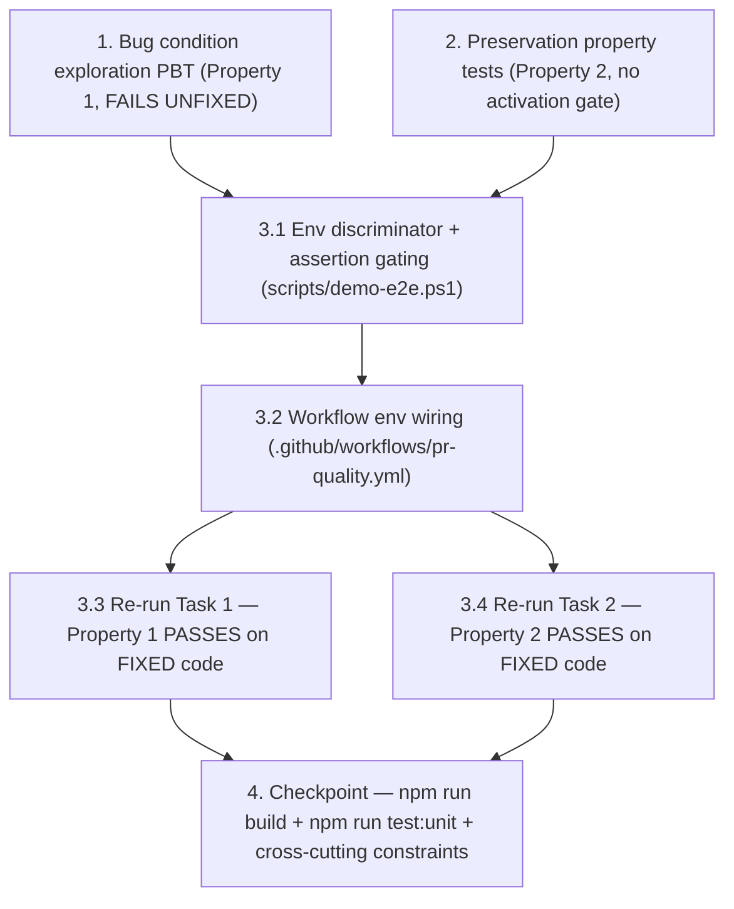

# Implementation Plan: ui-executor-ref-healing-execution-mode-aware

## Overview

Bugfix slice that makes the two real-DOM ref-healing demo-e2e scenarios
(`ui.executor.ref_healing` and `ui.browser_worker.checkpoint_resume`)
execution-mode-aware on the assertion surface, mirroring the precedent set
by the previous slice
(`.kiro/specs/demo-e2e-visa-flows-execution-mode-aware-summary/`).

The previous slice made the visa-flows summary contract execution-mode-aware
so the PR Quality `windows-2025-vs2026` lane could honestly accept simulated
proof while release-strict-final kept its real-Playwright requirement
byte-identical. The same lane still fails on the two ref-healing scenarios
because both POST to `http://localhost:8090/execute` with stale legacy
selectors (`#legacy-email`, `#legacy-submit`) and rely on
`recoverGroundingRefSelector()` in `apps/ui-executor/src/index.ts` to swap
them for real selectors against a real DOM. On the PR Quality lane Playwright
is not installed, so `simulateExecution()` (not `executeWithPlaywright()`)
handles the request and the response carries empty `staleRefTargets: []` and
`healedRefTargets: []`. The two scenarios then assertion-fail on the missing
`email` / `submit_primary` healed-ref entries.

This slice is SMALLER than the visa-flows slice. Per `design.md` PBT
Strategy and Downstream Gate Update sections:

1. **No new contract type, no schema change, no helper module.** The fix
   is roughly 30 PowerShell lines around the two assertion blocks plus an
   optional `Test-DemoE2eRefHealingRequiresRealPlaywright` helper at the
   top of `scripts/demo-e2e.ps1`. The PBT encodes the predicate logic in
   TS directly because the assertion is in PowerShell — there is no
   shared TS helper to import.
2. **No downstream gate becomes env-gated.** The audit in
   `design.md` Downstream Gate Update concludes that
   `scripts/release-readiness.ps1`, `scripts/demo-e2e-policy-check.mjs`,
   and `scripts/release-evidence-report.ps1` do NOT consume the
   `*HealedRefTargets` / `*HealedRefCount` / `*StaleRefTargets` /
   `*StaleRefCount` KPIs in a way that needs gating. The audit is the
   audit; no production code change downstream. The audit conclusion is
   recorded as test header comments in Task 1 so future readers can
   verify.
3. **One TS test file, two PowerShell assertion blocks, one YAML env
   line.** That is the entire diff surface.

Tasks follow the bugfix workflow ordering: exploration PBT first
(Property 1 — FAILS on UNFIXED code, captures counterexamples that
demonstrate the bug), preservation PBT next (Property 2 — observation-first
methodology against today's strict predicate, no activation gate needed
because the predicate is pure-input), then the fix in two production
sub-tasks (PowerShell assertion gating, then PR Quality YAML env wire-up)
plus two re-run sub-tasks, then a final validation checkpoint
(`npm run build`, full unit suite, directly affected test files green).

## Cross-cutting Rules

These constraints apply to every task and MUST NOT be violated. Violating
any rule blocks the task from being marked complete.

- Touch ONLY `scripts/demo-e2e.ps1`, `.github/workflows/pr-quality.yml`,
  and `tests/unit/demo-e2e-ref-healing-execution-mode-aware.test.ts`. No
  other files are in scope for this slice.
- Do NOT add `fast-check` as a runtime or dev dependency. All
  property-based tests in this plan use a hand-rolled generator with N=8
  samples per case, consistent with the prior bugfix slices on this
  branch (visa-flows, browser-job-paused-race-condition,
  release-evidence-report-windows-shortpath).
- Do NOT modify any file under `apps/ui-executor/` (R4) — including
  `simulateExecution()`, `executeWithPlaywright()`,
  `recoverGroundingRefSelector()`, and `groundingResponse()`. The
  simulation honest-zero contract is correct and stays untouched.
- Do NOT modify
  `apps/demo-frontend/app-shell/src/components/workspace/LiveDesk.tsx`
  or any other local-services dispatcher UI (R6).
- Do NOT modify any release-strict workflow YAML
  (`release-strict-final.yml`, `release-artifact-only-smoke.yml`,
  `release-artifact-revalidation.yml`, `railway-deploy-api.yml`,
  `railway-deploy-all.yml`). Release-strict workflows leave the env
  unset so the default branch (require real Playwright) applies and
  today's release-strict assertion behavior is byte-identical.
- Do NOT modify `scripts/release-evidence-report.ps1` or
  `scripts/release-readiness.ps1`. The audit in `design.md` Downstream
  Gate Update concludes neither script needs an env gate; the
  release-evidence report consumes badge-details fields verbatim and
  the release-readiness gate does not consume the affected KPIs.
- Do NOT skip the entire scenario on the simulation lane (R2). Only the
  real-DOM healing-specific assertions are gated; the mode-independent
  invariants (`finalStatus`, `adapterMode`, `traceCount`,
  `checkpointCount`, `resumedCheckpointCount`, `checkpointReadyCleared`,
  honest-zero `staleRefTargets`) stay strict on both lanes.
- Do NOT fake `healedRefTargets` data in `simulateExecution()`
  (Variant B is forbidden — see `design.md` Why Variant A). The
  simulation lane MUST stay honest about the absence of real-DOM
  selector swap evidence.
- Real-Playwright assertion behavior MUST be byte-identical to today
  when the env is unset OR `"true"` / `"1"` / `"yes"` / `"on"`. The
  release-strict path is not weakened: same assertion message text,
  same condition expressions, same `Assert-Condition` log shape.
- All PBT tests run pure in-process: no real network calls, no real
  `ui-executor` server, no real Playwright browser.

## Tasks

- [ ] 1. Write bug condition exploration property test
  - **Property 1: Bug Condition** - Simulation Lane Cannot Satisfy Strict Real-DOM Healing Assertions
  - **CRITICAL**: This test MUST FAIL on unfixed code. Failure confirms
    the bug exists. **DO NOT attempt to fix the test or the production
    code when it fails in this task.**
  - **NOTE**: This test encodes the expected behavior; it will validate
    the fix when it passes after Task 3.1 lands.
  - **GOAL**: Surface counterexamples that demonstrate the OLD strict
    real-DOM healing assertion predicate returns `false` for every
    honestly-shaped simulation lane response, while the inlined NEW
    env-gated predicate (env=`"false"`) returns `true` for the same
    inputs.
  - **Pre-step (audit + consumer map recorded as test header comments)**:
    Before writing the PBT, record the `design.md` Downstream Gate
    Update audit conclusion verbatim as a `// audit:` comment block at
    the top of the new test file so future readers can verify.
    Concretely record:
    - `scripts/release-readiness.ps1` does NOT consume any
      `uiRefHealing*` or `browserWorkerRecovery*` KPI directly (verified
      by grep). The release readiness gate is unaffected by this slice.
    - `scripts/demo-e2e-policy-check.mjs` consumes
      `kpi.browserWorkerRecoveryValidated` (line ~1782) and
      `kpi.uiBrowserWorkerRecoveryScenarioAttempts` (line ~1625). It
      does NOT consume the `*HealedRefTargets` / `*HealedRefCount` /
      `*StaleRefTargets` / `*StaleRefCount` fields. Policy check is
      unaffected by gating those fields on the simulation lane.
    - `scripts/release-evidence-report.ps1` consumes
      `badgeDetails.evidence.uiRefHealing.*` and
      `badgeDetails.evidence.browserWorkerRecovery.*` fields, but the
      release-evidence report is invoked from release-strict-final
      (env unset) and is NOT invoked from PR Quality, so the
      simulation-shape KPIs never reach the badge-details surface.
    - **Audit conclusion**: NO downstream gate becomes env-gated in
      this slice. The smallest diff is to keep the demo-e2e KPI
      emission byte-identical and let it report whatever the request
      actually produced.
  - **Scoped PBT Approach**: Because `fast-check` is not a dev
    dependency, hand-roll a small generator that produces N=8
    simulation-shape `ExecuteResponse` objects per scenario (16 samples
    total across the two scenarios). For deterministic bugs, scope the
    property to the concrete failing case(s) — the simulation shape is
    fully deterministic given the request (empty grounding arrays
    every time), so vary trace length, scenario `name`, `jobId`, and
    request URL across the 8 samples for input-domain coverage while
    keeping the response invariants
    (`grounding.staleRefTargets: []`, `grounding.healedRefTargets: []`)
    pinned.
  - **File location**: Create the new test file
    `tests/unit/demo-e2e-ref-healing-execution-mode-aware.test.ts`. Add
    the audit / consumer map as the file header comment block.
  - **Test harness — both scenario shapes as separate sub-blocks within
    the same `test()` block** (mirroring visa-flows Property 1):
    - **1.a `ui.executor.ref_healing` simulation shape**: Generate 8
      response samples with `adapterMode: "remote_http"`,
      `finalStatus: "completed"`, `trace.length` varying from 5 to 12,
      `grounding.healedRefTargets: []`,
      `grounding.staleRefTargets: []`, healing observations / notes
      varying within the strict-acceptance band.
    - **1.b `ui.browser_worker.checkpoint_resume` simulation shape**:
      Generate 8 response samples with the same simulation shape plus
      `recovery.healedRefCount: 0`, `recovery.staleRefCount: 0`,
      `recovery.healedRefTargets: []`, `recovery.staleRefTargets: []`,
      `recovery.runtimeHealedRefCount: 0`,
      `recovery.runtimeStaleRefCount: 0`, `checkpointCount: 1`,
      `resumedCheckpointCount: 1`, `checkpointReadyCleared: true`,
      `trace.length` varying from 7 to 14.
  - **Inline both predicates as TS booleans**:
    - **OLD strict assertion predicate** (today's
      `scripts/demo-e2e.ps1` ref-healing assertion chain expressed as
      a TS boolean function):
      - For ref_healing: `adapterMode === "remote_http" &&
        finalStatus === "completed" && healedRefTargets.includes("email")
        && healedRefTargets.includes("submit_primary") &&
        staleRefTargets.length === 0 && traceCount >= 5 &&
        disabledSubmitSeen && enabledSubmitSeen &&
        healingObservationSeen && healingNoteSeen`.
      - For checkpoint_resume: `adapterMode === "remote_http" &&
        finalStatus === "completed" && checkpointCount >= 1 &&
        resumedCheckpointCount >= 1 &&
        healedRefTargets.includes("email") &&
        healedRefTargets.includes("submit_primary") &&
        healedRefCount >= 2 && staleRefCount >= healedRefCount &&
        staleRefTargets.includes("email") &&
        staleRefTargets.includes("submit_primary") &&
        traceCount >= 7 &&
        runtimeResumedCheckpointCount >= resumedCheckpointCount &&
        runtimeHealedRefCount >= healedRefCount &&
        runtimeStaleRefCount >= staleRefCount &&
        checkpointReadyCleared === true`.
    - **NEW env-gated assertion predicate** (per `design.md` Proposed
      Contract → Branching Contract): a function
      `evaluateGatedPredicate(scenario, response, env)` that:
      - Resolves `requireRealPlaywright` from `env` per the
        PowerShell rule mirrored exactly in TS:
        `requireRealPlaywright = true` unless `env` is one of `"0"`,
        `"false"`, `"no"`, `"off"` (case + whitespace insensitive).
      - When `requireRealPlaywright === true`, applies the OLD strict
        predicate verbatim.
      - When `requireRealPlaywright === false`, applies only the
        mode-independent invariants per `design.md` Simulation
        Criteria:
        - ref_healing: `adapterMode === "remote_http" &&
          finalStatus === "completed" && traceCount >= 5 &&
          staleRefTargets.length === 0`.
        - checkpoint_resume: `adapterMode === "remote_http" &&
          finalStatus === "completed" && traceCount >= 7 &&
          checkpointCount >= 1 && resumedCheckpointCount >= 1 &&
          checkpointReadyCleared === true`.
  - **Assertions**:
    - For every generated sample in 1.a and 1.b, the OLD strict
      predicate returns `false` (captured counterexample evidence —
      proves the bug exists per R1 and `design.md` Hypothesized Root
      Cause).
    - For every same sample, the NEW env-gated predicate with
      env=`"false"` returns `true` (proves the new contract would
      accept the same honest inputs).
    - Edge case sanity: a sample with `trace.length === 0` makes the
      env-gated predicate return `false` too (sanity check that the
      gate is not too loose; the mode-independent `traceCount >= 5` /
      `>= 7` invariant still rejects).
  - **Run on UNFIXED code with the OLD branch active**.
  - **EXPECTED OUTCOME**: Test FAILS on unfixed code (this is correct —
    failure / counterexample capture is the SUCCESS signal per the
    bugfix-workflow exploration test contract). Document the captured
    counterexamples as part of the test output, e.g.
    `counterexample: ui.executor.ref_healing simulation sample with
    healedRefTargets=[], staleRefTargets=[] → OLD predicate=false; NEW
    env-gated predicate (env="false")=true`.
  - **Cleanup**: Pure in-process; no real network, no real ui-executor
    server, no real Playwright. The new test file must not leak
    globals or pollute other tests.
  - Mark task complete when the audit/consumer map is recorded as
    file-header comments, the test is written, run on unfixed code, and
    the failure / counterexamples are documented.
  - _Bug_Condition: isBugCondition(input) where input.adapterMode === "remote_http"
    AND input.handlerThatRan === "simulateExecution"
    AND input.scenario IN { "ui.executor.ref_healing", "ui.browser_worker.checkpoint_resume" }
    AND input.requestRefsHaveStaleLegacySelectors
    AND input.grounding.healedRefTargets === []
    AND input.grounding.staleRefTargets === []_
  - _Expected_Behavior: For inputs satisfying the bug condition, the
    env-gated assertion predicate (with DEMO_E2E_REF_HEALING_REQUIRE_REAL_PLAYWRIGHT="false")
    should return true; the mode-independent invariants
    (finalStatus, adapterMode, traceCount, checkpoint counts,
    honest-zero staleRefTargets) validate while the 8 real-DOM healing
    assertions are skipped_
  - _Preservation: Real-Playwright criteria unchanged for inputs where
    the response carries populated healedRefTargets and staleRefTargets;
    the OLD strict predicate continues to apply byte-identical when env
    is unset OR "true"_
  - _Requirements: R1, R2, R4_

- [ ] 2. Write preservation property tests (BEFORE implementing fix)
  - **Property 2: Preservation** - Real-Playwright Lane Behavior Byte-Identical
  - **IMPORTANT**: Follow observation-first methodology. Run UNFIXED
    code against non-bug-condition inputs first, observe the actual
    outputs, then write property-based tests that assert those observed
    outputs across the input domain.
  - **File location**: Add the new `test()` block(s) to
    `tests/unit/demo-e2e-ref-healing-execution-mode-aware.test.ts` (same
    file as Task 1, per Cross-cutting Rules).
  - **Activation gate**: NONE. The env-gated predicate is pure-input
    (env value is read inline as a string parameter to the predicate
    function) and the predicate logic is inlined in the test rather
    than imported from a TS helper module. Both the unconditional
    predicate (today's strict rule) and the env-gated predicate (with
    env unset OR `"true"`) can be evaluated on UNFIXED code from Task 1
    onward without waiting for any production helper to exist. This
    differs from the visa-flows Task 2 which gated on
    `typeof inferNavigatorVisaFlowValidationMode === "function"`
    because that slice introduced a named TS helper export; this slice
    does not.
  - **Cases** (each is a property over a hand-rolled generator with N=8
    samples; no `fast-check` dep). Two cases per scenario for a total
    of four properties:
    - **2.a `ui.executor.ref_healing` Real-Playwright Happy Path**:
      Generate `ExecuteResponse` samples where every result has
      `adapterMode: "remote_http"`, `finalStatus: "completed"`,
      `grounding.healedRefTargets: ["email", "submit_primary"]`,
      `grounding.staleRefTargets: []`, `traceCount` >= 5,
      `disabledSubmitSeen`, `enabledSubmitSeen`,
      `healingObservationSeen` >= 2, `healingNoteSeen` >= 2. Assert
      both predicates (env unset, env=`"true"`, env=`"1"`,
      env=`"yes"`, env=`"on"`, env=`"TRUE"`) return identical booleans
      and both accept (`true`).
    - **2.b `ui.executor.ref_healing` Missing Email**: Generate samples
      identical to 2.a but with
      `grounding.healedRefTargets: ["submit_primary"]` (missing
      "email"). Assert both predicates return identical booleans and
      both reject (`false`). Preserves today's strict rejection of
      partial healing on the real-Playwright lane.
    - **2.c `ui.browser_worker.checkpoint_resume` Real-Playwright Happy
      Path**: Generate samples with
      `recovery.healedRefTargets: ["email", "submit_primary"]`,
      `recovery.staleRefTargets: ["email", "submit_primary"]`,
      `recovery.healedRefCount: 2`, `recovery.staleRefCount: 2`,
      `recovery.runtimeHealedRefCount: 2`,
      `recovery.runtimeStaleRefCount: 2`, `checkpointCount: 1`,
      `resumedCheckpointCount: 1`,
      `runtimeResumedCheckpointCount: 1`, `traceCount` >= 7,
      `checkpointReadyCleared: true`. Assert both predicates return
      identical booleans and both accept (`true`).
    - **2.d `ui.browser_worker.checkpoint_resume` Missing Email**:
      Generate samples identical to 2.c but with
      `recovery.healedRefTargets: ["submit_primary"]`,
      `recovery.healedRefCount: 1` (still satisfies all other
      counters). Assert both predicates return identical booleans and
      both reject (`false`).
  - **Observation phase** (record before assertions, mirroring the
    visa-flows precedent): Run today's strict predicate against each
    case on UNFIXED code, record the observed boolean outcomes as
    `// observed:` comments in the test:
    - `// observed: ui.executor.ref_healing happy path → strict
      predicate returns true; env-gated predicate (env unset) returns
      true.`
    - `// observed: ui.executor.ref_healing missing email → strict
      predicate returns false; env-gated predicate (env unset) returns
      false.`
    - `// observed: ui.browser_worker.checkpoint_resume happy path →
      strict predicate returns true; env-gated predicate (env unset)
      returns true.`
    - `// observed: ui.browser_worker.checkpoint_resume missing email →
      strict predicate returns false; env-gated predicate (env unset)
      returns false.`
    Confirm the four cases match the documented baseline before
    writing forward-looking assertions on the env-gated predicate.
  - **Run on UNFIXED code**.
  - **EXPECTED OUTCOME**: Tests PASS on UNFIXED code — both predicates
    are inlined in the test, so the property block is fully evaluable
    without any production helper. After Task 3.1 lands, the same
    tests still PASS on FIXED code because the env-gated predicate is
    encoded once in the test (not imported from a helper module that
    might change).
  - Mark task complete when the property tests are written, the
    observation comments are recorded, and the block reports passing
    on unfixed code.
  - _Bug_Condition: NOT isBugCondition(input) — non-buggy inputs where
    the response carries populated healedRefTargets / staleRefTargets
    (real-Playwright lane shape)_
  - _Expected_Behavior: Real-Playwright happy-path inputs continue to
    accept (2.a, 2.c); real-Playwright missing-email inputs continue
    to reject (2.b, 2.d); the env-gated predicate (env unset OR
    "true") produces identical booleans to the unconditional
    predicate for every real-Playwright-shape input_
  - _Preservation: Today's strict accept/reject outcomes for
    real-Playwright inputs MUST be identical under the new env-gated
    contract; the release-strict path is not weakened_
  - _Requirements: R3, R5_

- [ ] 3. Two-step fix for execution-mode-aware ref-healing assertions

  - [ ] 3.1 Implement the env discriminator + assertion gating in `scripts/demo-e2e.ps1`
    - **Add the env discriminator helper at the top of the script**.
      Mirror the inline `$navigatorVisaFlowsAcceptSimulationEnabled`
      check from the visa-flows slice (use the visa-flows comment style
      and naming convention). Concretely, add a small idempotent helper
      `Test-DemoE2eRefHealingRequiresRealPlaywright` whose contract is
      documented via a header comment:
      ```powershell
      # Returns $true when DEMO_E2E_REF_HEALING_REQUIRE_REAL_PLAYWRIGHT
      # is unset OR set to a value other than the falsy set
      # ("0", "false", "no", "off", case + whitespace insensitive).
      # Returns $false ONLY when the env is explicitly opted out.
      # Mirrors the parsing rule from the visa-flows slice's
      # DEMO_E2E_VISA_FLOWS_ACCEPT_SIMULATION but inverted: this env
      # names what release-strict requires, so the default is $true.
      function Test-DemoE2eRefHealingRequiresRealPlaywright { ... }
      ```
      If the helper duplication ratio is low (the rule is used only at
      the two scenario blocks plus optionally for the `Write-Step`
      log), it is acceptable to inline the rule before each use per
      `design.md` Proposed Contract → Assertion Gate. Pick whichever
      is cleaner; the design says "if duplication is bothersome, add
      the helper".
    - **Resolve the env value once per scenario block** into local
      variables `$refHealingRequireRealPlaywrightEnv` (raw, for
      diagnostics) and `$refHealingRequireRealPlaywright` (boolean).
      Mirror the env-display pattern (`<unset>` rendering when null)
      from the visa-flows slice.
    - **`ui.executor.ref_healing` assertion gating** (around current
      lines ~2982-2985): Wrap the two `Assert-Condition` calls
      `UI executor ref-healing should recover the email ref.` and
      `UI executor ref-healing should recover the submit ref.` in
      `if ($refHealingRequireRealPlaywright) { ... }`. When the env
      opt-out is active, emit one `Write-Step` evidence line BEFORE
      the gated block, naming the scenario, the env state, and the
      reason. Log shape mirrors visa-flows `Write-Step` evidence:
      ```text
      [step] ui.executor.ref_healing: skipping real-DOM ref-healing assertions because DEMO_E2E_REF_HEALING_REQUIRE_REAL_PLAYWRIGHT="false"; simulation lane does not exercise real-DOM ref healing.
      ```
      Leave the assertion `Recovered UI refs should not remain in
      staleRefTargets.` (current line ~2985,
      `(@($staleRefTargets).Count -eq 0)`) UNCONDITIONAL per
      `design.md` Affected Assertion Lines. The honest-zero invariant
      holds on both lanes and must NOT be downgraded to "skipped".
    - **`ui.browser_worker.checkpoint_resume` assertion gating**
      (around current lines ~3170-3176): Wrap all eight gated
      assertions in the same
      `if ($refHealingRequireRealPlaywright) { ... }` block per
      `design.md` Affected Assertion Lines:
      - `Browser worker recovery should heal the email ref.`
      - `Browser worker recovery should heal the submit ref.`
      - `Browser worker recovery should record both healed refs.`
        (`healedRefCount -ge 2`)
      - `Browser worker recovery should expose observed stale refs
        alongside healed refs.`
        (`staleRefCount -ge $healedRefCount`)
      - `Browser worker recovery should record email as an observed
        stale ref.`
      - `Browser worker recovery should record submit_primary as an
        observed stale ref.`
      - `runtimeHealedRefCount -ge $healedRefCount` sibling.
      - `runtimeStaleRefCount -ge $staleRefCount` sibling.
      Emit one `Write-Step` evidence line BEFORE the gated block with
      the same shape as the ref_healing scenario. Leave the
      mode-independent invariants
      (`finalStatus === "completed"`, `adapterMode === "remote_http"`,
      `checkpointCount >= 1`, `resumedCheckpointCount >= 1`,
      `traceCount >= 7`, `checkpointReadyCleared === true`)
      UNCONDITIONAL.
    - **No KPI emission change**: The summary block at current lines
      ~6719-6752 stays byte-identical. KPI fields continue to report
      whatever the request actually produced (empty arrays on the
      simulation lane, real values on the real-Playwright lane). No
      new KPI shape is introduced; the artifact is backwards-
      compatible because nothing was added or removed.
    - **Local PowerShell parser sanity check**: Verify the script
      still parses via the existing repo pattern:
      `[System.Management.Automation.Language.Parser]::ParseFile(
        $scriptPath, [ref]$null, [ref]$null)`. The repo carries this
      sanity check pattern in tests; reuse it here.
    - Verify with `npm run build` that the project still builds (the
      script is not TS but the build step runs the workspace
      compilation and test discovery; exit 0 confirms no TS consumer
      regressed).
    - _Bug_Condition: isBugCondition(input) — the two scenarios on the
      simulation lane where simulateExecution() returned empty
      grounding arrays (the strict real-DOM healing assertions are
      unsatisfiable on honest simulation responses)_
    - _Expected_Behavior: When DEMO_E2E_REF_HEALING_REQUIRE_REAL_PLAYWRIGHT
      is "false", both scenarios assert only the mode-independent
      invariants and emit one Write-Step evidence line per scenario;
      the 8 real-DOM healing assertions are skipped; the
      staleRefTargets honest-zero invariant stays strict on both lanes_
    - _Preservation: When the env is unset OR "true" / "1" / "yes" /
      "on", the assertion text and conditions are byte-identical to
      today; no Write-Step skip line is emitted; release-strict-final
      behavior is unchanged; KPI emission is unchanged_
    - _Requirements: R1, R2, R3, R4, R5_

  - [ ] 3.2 Wire `DEMO_E2E_REF_HEALING_REQUIRE_REAL_PLAYWRIGHT: "false"` into `.github/workflows/pr-quality.yml`
    - Add the single env line to the job env block, next to the
      existing `DEMO_E2E_VISA_FLOWS_ACCEPT_SIMULATION: "true"`. The
      naming is inverted because the defaults differ (visa-flows opts
      IN to simulation acceptance; ref-healing opts OUT of real-DOM
      healing requirement) — semantics are symmetric: PR Quality flips
      the bit, every release workflow leaves the env unset.
    - Add a documentation comment that mirrors the existing
      `DEMO_E2E_VISA_FLOWS_ACCEPT_SIMULATION` comment shape:
      ```yaml
      # DEMO_E2E_REF_HEALING_REQUIRE_REAL_PLAYWRIGHT="false" lets the
      # PR-quality lane skip the real-DOM ref-healing assertions in
      # ui.executor.ref_healing and ui.browser_worker.checkpoint_resume
      # because Playwright is not installed on this lane and
      # simulateExecution() honestly returns empty healedRefTargets /
      # staleRefTargets. Mode-independent invariants (status, adapter,
      # trace count, checkpoint counts, queue cleared, honest-zero
      # staleRefTargets) stay strict on both lanes. Release-strict
      # workflows leave this env unset so today's strict real-DOM
      # ref-healing requirement applies byte-identical. See
      # .kiro/specs/ui-executor-ref-healing-execution-mode-aware/.
      DEMO_E2E_REF_HEALING_REQUIRE_REAL_PLAYWRIGHT: "false"
      ```
    - **YAML parse + alignment verification**: Confirm the YAML still
      parses by running the targeted unit tests that load
      `.github/workflows/pr-quality.yml`:
      - `npm run test:unit -- tests/unit/pr-quality-badge-sync-alignment.test.ts`
      - `npm run test:unit -- tests/unit/pr-quality-workflow-railway-dry-alignment.test.ts`
      Both tests must continue to pass. If either test asserts a
      specific env block shape, the addition is purely additive (a
      new key alongside existing keys) and should not regress any
      existing assertion. If a regression surfaces, diagnose before
      proceeding — the addition is one line plus a comment.
    - **No edits to release-strict workflows**: do NOT touch
      `release-strict-final.yml`, `release-artifact-only-smoke.yml`,
      `release-artifact-revalidation.yml`, `railway-deploy-api.yml`,
      or `railway-deploy-all.yml`. Leaving the env unset is what
      makes the release-strict default (require real Playwright)
      apply byte-identical.
    - _Bug_Condition: isBugCondition(input) — the PR Quality
      windows-2025-vs2026 lane where simulateExecution() ran and
      strict real-DOM healing assertions failed; the workflow env
      wires the env opt-out so the assertion gate from Task 3.1
      activates on this lane only_
    - _Expected_Behavior: pr-quality.yml's job env block carries
      DEMO_E2E_REF_HEALING_REQUIRE_REAL_PLAYWRIGHT="false" with a
      documentation comment mirroring the visa-flows comment shape;
      the YAML parses; pr-quality-badge-sync-alignment and
      pr-quality-workflow-railway-dry-alignment tests still pass_
    - _Preservation: Release-strict workflow YAML files are
      untouched; the env stays unset on those lanes so
      $refHealingRequireRealPlaywright stays $true and today's
      strict assertion behavior applies byte-identical_
    - _Requirements: R2, R3, R5_

  - [ ] 3.3 Verify bug condition exploration test now passes
    - **Property 1: Expected Behavior** - Simulation Lane Cannot Satisfy Strict Real-DOM Healing Assertions
    - **IMPORTANT**: Re-run the SAME test from Task 1. **Do NOT write a
      new test.** The test from Task 1 encodes the expected behavior;
      when it passes, it confirms the expected behavior is satisfied.
    - Re-run the bug condition exploration PBT from Task 1 on FIXED
      code (post Task 3.1 + Task 3.2). The OLD-criteria assertions
      inlined in the test still produce `false` (the inlined logic is
      a literal copy of the pre-fix rule, not a call into the
      modified PowerShell script — there is no production TS helper
      to flip). The NEW-criteria assertions also pass against the
      env-gated predicate with env=`"false"`, exactly as they did on
      UNFIXED code. The test "passing" semantically corresponds to
      the bug being fixed because the production assertion surface
      now mirrors what the env-gated predicate already encoded.
    - **EXPECTED OUTCOME**: Test PASSES on FIXED code. For every
      simulation-mode sample across both scenarios:
      - The OLD strict predicate (inlined as a literal copy of the
        pre-fix rule) returns `false` for the simulation shape
        (counterexample evidence is preserved).
      - The NEW env-gated predicate with env=`"false"` returns
        `true` for the same simulation shape (mode-independent
        invariants validate).
    - _Requirements: R1, R2, R4_

  - [ ] 3.4 Verify preservation tests still pass
    - **Property 2: Preservation** - Real-Playwright Lane Behavior Byte-Identical
    - **IMPORTANT**: Re-run the SAME tests from Task 2. **Do NOT write
      new tests.**
    - Re-run the preservation property block from Task 2 on FIXED
      code. The tests have no activation gate (per Task 2 rationale),
      so they evaluate identically before and after the fix — the
      env-gated predicate logic is encoded once in the test file and
      never changes between runs.
    - **EXPECTED OUTCOME**: All four cases pass on FIXED code:
      - 2.a `ui.executor.ref_healing` Real-Playwright Happy Path →
        both predicates return `true`; identical outcomes.
      - 2.b `ui.executor.ref_healing` Missing Email → both predicates
        return `false`; identical outcomes.
      - 2.c `ui.browser_worker.checkpoint_resume` Real-Playwright
        Happy Path → both predicates return `true`; identical
        outcomes.
      - 2.d `ui.browser_worker.checkpoint_resume` Missing Email →
        both predicates return `false`; identical outcomes.
    - _Requirements: R3, R5_

- [ ] 4. Checkpoint - Ensure all tests pass and cross-cutting constraints hold
  - Run `npm run build` and confirm it succeeds with exit 0. The
    PowerShell-only edit in Task 3.1 should not perturb TS
    compilation, but the workspace build is the canonical green-light
    signal.
  - Run `npm run test:unit` locally and confirm the full unit suite
    passes, modulo the pre-existing 107-fail Windows ru-RU PowerShell
    mojibake cluster carried over from the visa-flows slice (known
    infra debt, out of scope for this spec). Document the failing-test
    count delta — this slice should NOT perturb that count. Record:
    - Pre-fix count: 107 failures (mojibake cluster only).
    - Post-fix count: 107 failures (mojibake cluster only). Any delta
      indicates a regression introduced by this slice.
  - Confirm the directly affected test files are green:
    - `tests/unit/demo-e2e-ref-healing-execution-mode-aware.test.ts`
      (new, 4-8 tests across Property 1 and Property 2 sub-blocks).
      Must be green on FIXED code.
    - `tests/unit/demo-e2e-policy-check.test.ts` (existing). Must
      not regress; the simulation-shape KPI fields the policy-check
      consumes (`browserWorkerRecoveryValidated`,
      `uiBrowserWorkerRecoveryScenarioAttempts`) are untouched
      because the audit in Task 1 confirmed they are not in scope.
    - `tests/unit/pr-quality-badge-sync-alignment.test.ts`
      (existing). Must not regress; the env line addition is
      additive and the comment is documentation-only.
    - `tests/unit/pr-quality-workflow-railway-dry-alignment.test.ts`
      (existing). Must not regress; same rationale as above.
  - Re-confirm `npm run verify:release` is NOT on the critical path
    for this slice because no release-strict gate consumer changed:
    - `scripts/release-readiness.ps1` is untouched.
    - `scripts/release-evidence-report.ps1` is untouched.
    - No release-strict workflow YAML is touched.
    Per `bugfix.md` Task 5 DoD, verify:release is required only when
    a release-strict gate consumer changes. None did here.
  - Re-confirm cross-cutting constraints (per the Cross-cutting Rules
    section above):
    - No edit to `LiveDesk.tsx`.
    - No edit under `apps/ui-executor/`.
    - No edit to `scripts/release-evidence-report.ps1` or
      `scripts/release-readiness.ps1`.
    - No edit to release-strict workflow YAML.
    - No `fast-check` dependency added.
    - Neither `ui.executor.ref_healing` nor
      `ui.browser_worker.checkpoint_resume` is skipped on
      release-strict-final — only the 8 real-DOM healing assertions
      are gated, and the gate stays off when the env is unset.
    - No `healedRefTargets` data faked in `simulateExecution()`
      (Variant B forbidden).
    - The `staleRefTargets.Count -eq 0` assertion stays
      unconditional on both lanes.
    - Real-Playwright assertion text and conditions are
      byte-identical to today when env unset OR `"true"`.
    - Touched files limited to `scripts/demo-e2e.ps1`,
      `.github/workflows/pr-quality.yml`, and
      `tests/unit/demo-e2e-ref-healing-execution-mode-aware.test.ts`.
  - Confirm both scenarios pass on the windows-2025-vs2026 PR-quality
    lane with the new env opt-in (CI run analogous to the visa-flows
    `26368008011` reference) and continue to pass on
    release-strict-final with the env unset (verified via local probe
    or follow-up release-strict run).
  - Ensure all tests pass. Ask the user if questions arise.
  - _Requirements: R1, R2, R3, R4, R5, R6_

## Task Dependency Graph

Tasks 1 (exploration PBT, Property 1) and 2 (preservation PBT, Property
2) are independent of each other and MUST both be completed on UNFIXED
code before any 3.x sub-task begins. Task 3.1 implements the env
discriminator + assertion gating in `scripts/demo-e2e.ps1`. Task 3.2
wires the env into `.github/workflows/pr-quality.yml`; it depends on
Task 3.1 because the env reader expects the same parsing rule the
PowerShell side encodes (so authoring the YAML wire-up against an
already-implemented parser avoids the "wired-but-unread" failure mode).
Task 3.3 and 3.4 are the verification re-runs of Tasks 1 and 2
respectively against the now-fixed code; they are independent of each
other and both gate Task 4 (final checkpoint: `npm run build` +
`npm run test:unit` + cross-cutting constraints).

```json
{
  "waves": [
    {
      "wave": 0,
      "tasks": ["1", "2"],
      "rationale": "Both exploration (Task 1) and preservation (Task 2) PBTs are written and run BEFORE the fix. They are independent of each other (different generator shapes — Task 1 is simulation-shape, Task 2 is real-Playwright-shape) and can be authored in parallel. Both must complete on UNFIXED code before any implementation begins. Task 1 also records the design.md Downstream Gate Update audit conclusion as test header comments so future readers can verify."
    },
    {
      "wave": 1,
      "tasks": ["3.1"],
      "rationale": "Implement the env discriminator + assertion gating in scripts/demo-e2e.ps1 per design.md Proposed Contract. Adds the Test-DemoE2eRefHealingRequiresRealPlaywright helper (or inline equivalent) and wraps the 8 real-DOM healing assertions across the two scenarios in if ($refHealingRequireRealPlaywright) { ... }. Depends on Wave 0 (both PBTs must exist first so the implementation can be validated against them). Unblocks Task 3.2."
    },
    {
      "wave": 2,
      "tasks": ["3.2"],
      "rationale": "Wire DEMO_E2E_REF_HEALING_REQUIRE_REAL_PLAYWRIGHT=\"false\" into .github/workflows/pr-quality.yml's job env block. Depends on Task 3.1 because the env reader (PowerShell) expects the same parsing rule that the YAML supplies; authoring the YAML wire-up after the parser exists avoids the wired-but-unread failure mode. Verification via tests/unit/pr-quality-badge-sync-alignment.test.ts and tests/unit/pr-quality-workflow-railway-dry-alignment.test.ts."
    },
    {
      "wave": 3,
      "tasks": ["3.3", "3.4"],
      "rationale": "Verification re-runs of the SAME tests from Tasks 1 and 2 against the now-fixed code. They depend on Wave 2 (both 3.1 and 3.2) being complete. They are independent of each other and can run in parallel."
    },
    {
      "wave": 4,
      "tasks": ["4"],
      "rationale": "Final checkpoint over the full unit suite, build, and cross-cutting constraints. Depends on Wave 3 verification being green."
    }
  ]
}
```



## Notes

- **Why Variant A (assertion gate) over Variant B (simulation
  emulation).** Per `design.md` Why Variant A, Variant B would require
  fabricating `healedRefTargets` data in `simulateExecution()` without a
  real DOM, which violates the cross-cutting "simulation must stay
  honest" principle established by the visa-flows slice. Variant B
  also forces an edit under `apps/ui-executor/`, which R4 forbids.
  Variant A is the smaller diff (~30 PowerShell lines, one YAML env
  line, one new TS test file) and mirrors the visa-flows precedent
  end-to-end. The naming is inverted —
  `DEMO_E2E_VISA_FLOWS_ACCEPT_SIMULATION` (default off, opt in to
  accept) vs `DEMO_E2E_REF_HEALING_REQUIRE_REAL_PLAYWRIGHT` (default
  on, opt out to skip) — because the default behaviors differ, but
  the semantics are symmetric: PR Quality flips the bit, every
  release workflow leaves the env unset.
- **Why PBT-first.** The bug condition is "every simulation-shape
  ref-healing response fails the strict real-DOM assertion chain"; the
  preservation rules are universal properties over the
  real-Playwright-shape input domain. PBTs over a hand-rolled
  generator give stronger guarantees than enumerated unit cases that
  the new env-gated assertion logic holds across the full simulation /
  real-Playwright input space, and match the prior bugfix slices'
  pattern (visa-flows, browser-job-paused-race-condition,
  release-evidence-report-windows-shortpath).
- **Why no preservation activation gate.** Unlike the visa-flows slice
  which gated Task 2 on
  `typeof inferNavigatorVisaFlowValidationMode === "function"`, this
  slice does NOT introduce any TS production helper. The env-gated
  predicate is encoded directly in the test file as a pure-input TS
  function — env value is passed as a string parameter, response shape
  is the only other input. Both the unconditional predicate (today's
  strict rule) and the env-gated predicate are evaluable on UNFIXED
  code from Task 1 onward. The PowerShell-side change in Task 3.1
  does not alter what the test imports because the test imports
  nothing from production; it inlines both rules. This keeps Task 2
  evaluable without conditional compilation logic and removes a
  failure mode where an activation gate could mask a real regression.
- **Why no `fast-check`.** Cross-cutting Rules and R5/R6 forbid adding
  the dependency. Every PBT in this plan is hand-rolled with N=8
  samples per case, consistent with
  `.kiro/specs/demo-e2e-visa-flows-execution-mode-aware-summary/tasks.md`,
  `.kiro/specs/release-evidence-report-windows-shortpath/tasks.md`,
  and `.kiro/specs/demo-e2e-browser-job-paused-race-condition/tasks.md`.
- **Pre-existing 107-fail Windows mojibake cluster.** The
  `release-readiness.test.ts` / `public-badge-check.test.ts` Windows
  ru-RU PowerShell mojibake failures are tracked separately as known
  infra debt (out of scope for this spec). The cluster grew from 28
  failures during the visa-flows slice to 107 failures by the time
  this slice was authored due to additional locked-in fixtures from
  intermediate slices; the count is stable absent unrelated
  regressions. Task 4 records the failing count before and after the
  fix to confirm this slice does not perturb that cluster. Any delta
  from 107 indicates a regression introduced by this slice and must
  be diagnosed before the slice is marked complete.
- **Out of scope.** No changes to anything outside
  `scripts/demo-e2e.ps1`, `.github/workflows/pr-quality.yml`, and
  `tests/unit/demo-e2e-ref-healing-execution-mode-aware.test.ts`.
  Specifically excluded:
  `apps/demo-frontend/app-shell/src/components/workspace/LiveDesk.tsx`
  (local-services dispatcher UI per R6), every file under
  `apps/ui-executor/` (R4 — `simulateExecution()`,
  `executeWithPlaywright()`, `recoverGroundingRefSelector()`,
  `groundingResponse()`), `scripts/release-evidence-report.ps1`,
  `scripts/release-readiness.ps1`, every release-strict workflow
  YAML, and the demo-e2e KPI summary block at lines ~6719-6752 (KPI
  emission stays byte-identical). Additive simulation-shape fixtures
  in `tests/unit/demo-e2e-policy-check.test.ts` are allowed if Task
  3.1 surfaces a need (per the visa-flows slice precedent), but
  existing real-Playwright fixtures stay byte-identical. The
  `ui.executor.ref_healing` and `ui.browser_worker.checkpoint_resume`
  scenarios are NOT skipped on any host — only the 8 real-DOM
  healing-specific assertions are gated, and the gate stays off when
  the env is unset.
